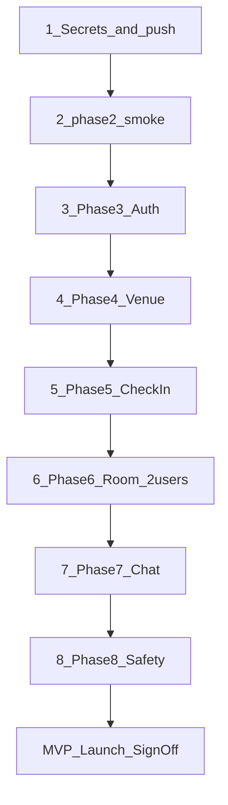

# Phase 9 — Launch orchestration

**Remaining steps & env vars:** [FINAL_CHECKLIST.md](./FINAL_CHECKLIST.md) · **Secrets setup:** [PHASE9_SETUP.md](./PHASE9_SETUP.md)

Master guide for taking Side Quest from repo-complete (Phases 1–8) to MVP-validated on a live Supabase project.

**Companion docs:** [PHASE9_SETUP.md](./PHASE9_SETUP.md) (secrets checklist) · [PHASE3_AUTH.md](./PHASE3_AUTH.md) through [PHASE8_SAFETY.md](./PHASE8_SAFETY.md) (per-phase live validation)

---

## Who does what

### You (manual — credentials & dashboards)

| Step | Action |
|------|--------|
| 1 | Create Supabase project → copy URL + anon key |
| 2 | `cp .env.example .env` and fill required vars |
| 3 | Supabase Auth: enable Phone (start here), Google, Apple |
| 4 | Add redirect URLs: `sidequest://auth/callback` + Expo dev URI ([PHASE3_AUTH](./PHASE3_AUTH.md)) |
| 5 | Google Cloud OAuth clients (Web minimum) |
| 6 | Apple Developer Sign in with Apple (iOS) |
| 7 | Two test accounts; simulator GPS near Sydney seed venues ([PHASE4_VENUE](./PHASE4_VENUE.md)) |
| 8 | Real privacy/terms URLs before store submission (dev E2E can use placeholders) |

### Agent (after `.env` exists)

| Step | Command / action |
|------|------------------|
| Verify env | `npm run verify:env` |
| Link + push | `supabase login` → `link` → `db push` → seed |
| Smoke | Run `supabase/tests/phase2_smoke.sql` in SQL Editor |
| Types | `npm run db:types` (optional diff) |
| Boot | `npm start` — config banners should be gone |
| Guide | Walk through Phases 3–8 validation below |

---

## Execution order (waterfall)

Do not skip phases. Each step depends on the previous.

```
Secrets + db push → Phase 3 Auth → Phase 4 Venue → Phase 5 Check-in
  → Phase 6 Two-user room → Phase 7 Chat → Phase 8 Safety → MVP sign-off
```



---

## Step 0 — Environment verification

```bash
cp .env.example .env
# Fill EXPO_PUBLIC_SUPABASE_URL and EXPO_PUBLIC_SUPABASE_ANON_KEY

npm run verify:env
npm install
npm run typecheck
```

Expect `isSupabaseConfigured: true` when keys are real (not placeholder).

---

## Step 1 — Remote database

```bash
supabase login
supabase link --project-ref <your-ref> --yes
supabase db push --linked --yes
supabase db execute -f supabase/seed.sql --linked
supabase migration list --linked   # 6 rows, Local = Remote
```

**SQL Editor:** run [supabase/tests/phase2_smoke.sql](../supabase/tests/phase2_smoke.sql) — all checks pass ([README](../supabase/tests/README.md)).

**Optional:**

```bash
npm run db:types
# Compare types/database.generated.ts vs types/database.ts
```

---

## Step 2 — Phase 3 live (auth)

Doc: [PHASE3_AUTH.md](./PHASE3_AUTH.md)

**Recommended order:** Phone OTP first (simplest), then Google, then Apple on iOS.

- [ ] Phone: send + verify OTP
- [ ] Google OAuth returns via `sidequest://auth/callback`
- [ ] Apple Sign In (iOS)
- [ ] Session persists after app kill
- [ ] New user gets `profiles` row (trigger + `ensureProfile`)
- [ ] No check-in → venue picker; sign-out → hero

---

## Step 3 — Phase 4 live (venue)

Doc: [PHASE4_VENUE.md](./PHASE4_VENUE.md)

- [ ] 5 seed venues in DB
- [ ] Simulator GPS near venue (e.g. The Ivy, Sydney) → selectable
- [ ] Far location → venues disabled
- [ ] First-visit venue tooltip once
- [ ] Tap venue → check-in screen with `venueId`

---

## Step 4 — Phase 5 live (check-in)

Doc: [PHASE5_CHECKIN.md](./PHASE5_CHECKIN.md)

- [ ] Mode-specific fields validate
- [ ] Check-in inserts row with fresh `expires_at`
- [ ] Lands on room screen
- [ ] SQL: `select * from check_ins where user_id = '<uid>'`

---

## Step 5 — Phase 6 live (room — two users)

Doc: [PHASE6_ROOM.md](./PHASE6_ROOM.md)

**Setup:** Two simulators or device + simulator. Same venue + same mode. Different accounts.

- [ ] Both users appear in each other's deck
- [ ] User A Connect → User B sees incoming; Connect back → connected
- [ ] **Pull-to-refresh** on User B's room if connect state lags (connections not in Realtime)
- [ ] Navigate to chat after mutual connect
- [ ] Block removes peer from deck
- [ ] Different mode → invisible to each other

---

## Step 6 — Phase 7 live (chat)

Doc: [PHASE7_CHAT.md](./PHASE7_CHAT.md)

- [ ] Messages appear on both devices via Realtime
- [ ] Profanity filter blocks send (e.g. "spam")
- [ ] Manual checkout from chat → venue picker
- [ ] Optional: shorten `expires_at` in SQL for expiry test; far GPS for geo auto-checkout

---

## Step 7 — Phase 8 live (safety)

Doc: [PHASE8_SAFETY.md](./PHASE8_SAFETY.md)

- [ ] Report from room with reason + details → SQL row in `reports`
- [ ] Report from chat with `connection_id`
- [ ] Block list modal shows entry
- [ ] Tooltips: venue, check-in, room (clear `tooltip:*` AsyncStorage keys to retest)
- [ ] Privacy/Terms links open when URLs set

**SQL:**

```sql
select id, reason, details, connection_id, created_at
from public.reports where reporter_id = '<uid>' order by created_at desc;

select blocked_id, created_at from public.blocks where blocker_id = '<uid>';
```

---

## Step 8 — Security audit

### Repo scan (no credentials)

```bash
grep -r "service_role" --include="*.ts" --include="*.tsx" . 
# Expect: no matches in app/lib
```

`.env` must be gitignored; only `.env.example` committed.

### Post-push SQL

Run [supabase/tests/phase9_rls_probe.sql](../supabase/tests/phase9_rls_probe.sql) in SQL Editor — policy structure checks.

### App-level RLS (requires signed-in users)

| Test | Expected |
|------|----------|
| Client `select` all `profiles` | Only own row (or error/empty for others) |
| Client `select` all `check_ins` | Only own row |
| Discovery | Only via `get_room_peers` RPC — no direct peer listing |
| Venue counts | Aggregates only — no names in count RPC |

Document results in your launch notes.

---

## Step 9 — MVP launch sign-off

Mark complete in [PHASE9_SETUP.md](./PHASE9_SETUP.md) §6 when all validated.

### Core

- [ ] Full E2E: signup → venue → check-in → connect → chat → checkout
- [ ] Auto checkout (expiry; geo optional)
- [ ] Block removes peer
- [ ] Venue counts = aggregates only

### Security

- [ ] RLS probe + app tests documented
- [ ] No `service_role` in client bundle
- [ ] `.env` not committed

### Quality

- [ ] iOS + Android smoke (simulator OK for dev sign-off)
- [ ] Error states: no GPS, network, expired session
- [ ] A11y on primary actions

---

## EAS / store builds (optional, post-dev E2E)

Repo includes [`eas.json`](../eas.json) skeleton. When ready:

```bash
npm i -g eas-cli
eas login
eas init   # merges with existing eas.json if present
eas build --profile preview --platform ios
```

See [PHASE9_SETUP.md](./PHASE9_SETUP.md) §7. Store **submission** is post-MVP.

---

## Post-MVP (not blocking launch)

- App Store / Play Store submission assets
- Production `moderate-report` Edge Function
- Connections Realtime publication
- Push notifications
- Custom venue seed for non-Sydney cities

---

## Quick reference

| Phase | Validation doc |
|-------|----------------|
| 2 Push | [supabase/tests/README.md](../supabase/tests/README.md) |
| 3 Auth | [PHASE3_AUTH.md](./PHASE3_AUTH.md) |
| 4 Venue | [PHASE4_VENUE.md](./PHASE4_VENUE.md) |
| 5 Check-in | [PHASE5_CHECKIN.md](./PHASE5_CHECKIN.md) |
| 6 Room | [PHASE6_ROOM.md](./PHASE6_ROOM.md) |
| 7 Chat | [PHASE7_CHAT.md](./PHASE7_CHAT.md) |
| 8 Safety | [PHASE8_SAFETY.md](./PHASE8_SAFETY.md) |
| DB skill | [.cursor/skills/supabase-linked-migrations/SKILL.md](../.cursor/skills/supabase-linked-migrations/SKILL.md) |
