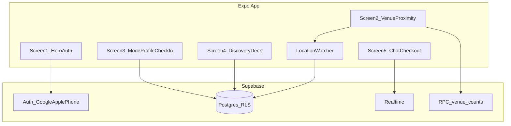
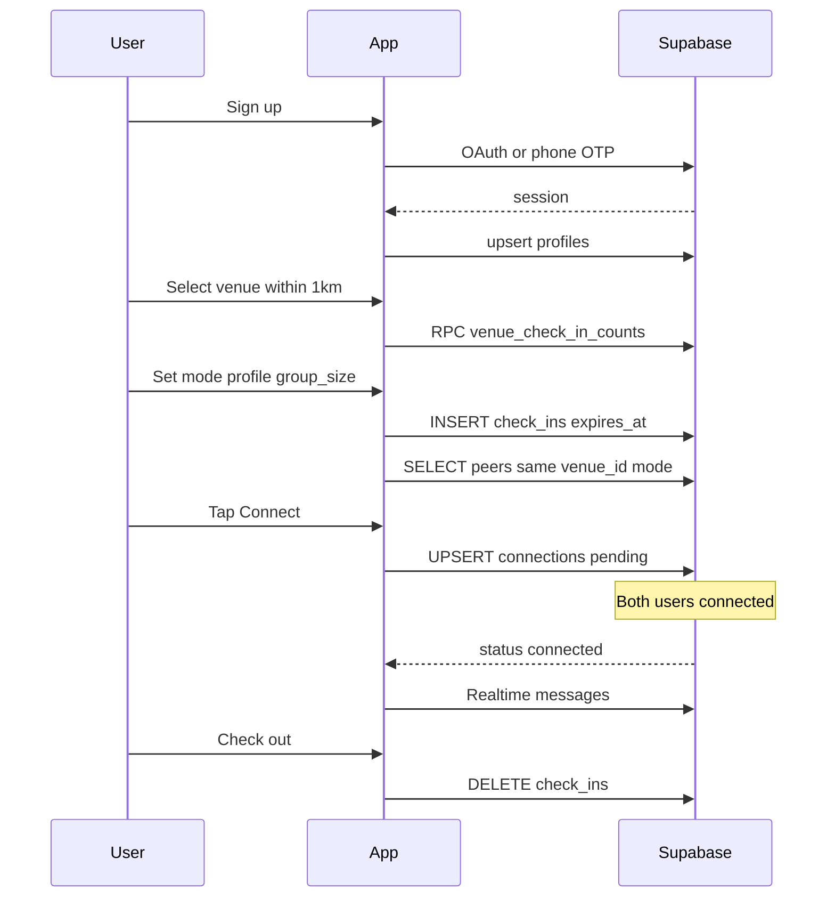
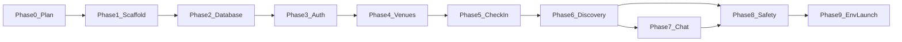

# Side Quest — Phase 0: Master Product Plan

## Product thesis

**Side Quest** is a venue-anchored social radar: users are **invisible by default**, become visible only while actively checked in at a venue, and are discoverable only to others in the **same venue + same intent mode** (friends / dating / networking). Sessions are **time-limited** and end on manual check-out, geo exit, or `expires_at`.

**MVP success criteria**

- User can sign up (Google, Apple, phone), pick a nearby venue (≤1 km), set mode + profile fields + group size, see others in the room, mutually connect, chat, block, and check out (manual + automatic).
- No user appears in discovery without an active `check_ins` row.
- Venue list shows **public active check-in counts** (aggregate only, no PII).

**Workspace state today:** repo contains only [`.cursor/`](.cursor/) agent configuration — **no app code, no `package.json`, no `supabase/`**. All implementation phases start from zero.

**Confirmed assumptions**

- **Platforms:** iOS + Android via **Expo managed workflow**
- **Backend:** new **Supabase** project created in the final phase

---

## Tech stack

| Layer | Choice | Rationale |
|-------|--------|-----------|
| Mobile | Expo SDK 52+ / React Native | User spec; fast iteration, OTA updates later |
| Navigation | `expo-router` (file-based) | Expo default; maps cleanly to 5 core screens |
| Auth | Supabase Auth | Google, Apple, phone OTP native support |
| DB | Supabase Postgres + RLS | Privacy-by-default; venue/mode scoping in SQL |
| Realtime | Supabase Realtime | Ephemeral chat subscriptions |
| Location | `expo-location` | GPS + background geo-fence for auto check-out |
| State | React Context + hooks (MVP) | Keep simple; no Redux until needed |
| Styling | NativeWind or StyleSheet | Pick one in Phase 1; default NativeWind for speed |

---

## Target repo layout (created in Phase 1)

```text
sidequest/
  app/                    # expo-router screens
    (auth)/
    (onboarding)/
    (main)/
  components/
  lib/
    supabase.ts
    geo.ts
    connections.ts
  hooks/
  types/
  supabase/
    migrations/
    seed.sql              # dev venues
  .env.example
  app.json
  package.json
```

---

## Architecture



---

## Core user flow



---

## Database design (extends user blueprint)

### Base tables (from product spec)

- [`profiles`](profiles) — segmented fields per mode
- [`venues`](venues) — name, lat, lng
- [`check_ins`](check_ins) — one active row per user (`unique(user_id)`), mode, group_size, `expires_at`
- [`connections`](connections) — mutual match at same venue

### MVP additions (required for stated features)

| Table / object | Purpose |
|----------------|---------|
| `blocks` | Instant block; excluded from discovery + chat |
| `messages` | Ephemeral chat tied to `connection_id` |
| `reports` | User reports; stub for AI moderation pipeline |
| `handle_new_user` trigger | Auto-create `profiles` row on `auth.users` insert |
| `venue_active_check_in_counts` view or RPC | Public aggregate counts per venue |
| `get_room_peers` RPC | Returns discoverable users: same `venue_id`, same `mode`, active non-expired check-in, not blocked |
| `request_connection` RPC | Atomic mutual-connect logic |
| `checkout_user` RPC | Delete check-in, optionally archive connection state |

### `connections` mutual-match model

Extend the spec schema with directional flags (cleaner than duplicate rows):

```sql
-- additions to connections
user_one_wants boolean default false,
user_two_wants boolean default false,
-- status = 'connected' when both true; 'pending' otherwise
-- enforce user_one < user_two for canonical pair
```

**Connect flow:** upsert pair `(min(uid), max(uid))`; set caller's `*_wants = true`; if both true → `status = 'connected'`.

### `check_ins` lifecycle defaults

- `expires_at` = `now() + interval '4 hours'` on insert (configurable constant in app + migration default)
- **Post-checkout grace:** optional `checked_out_at` not needed for MVP — delete row immediately on check-out
- **Auto check-out triggers:** app-side watcher when distance > 1 km OR `expires_at` passed; server cron optional in post-MVP

### Row Level Security (privacy core)

| Table | Policy summary |
|-------|----------------|
| `profiles` | Owner full CRUD; **read others only via `get_room_peers` RPC** (security definer) |
| `check_ins` | Owner insert/update/delete own; no public SELECT (counts via RPC only) |
| `venues` | Public read |
| `connections` | Participants read/update own rows |
| `messages` | Read/write only when `connection.status = 'connected'` and participant |
| `blocks` | Owner insert; used in RPC filters |

**Principle:** direct table SELECT on `profiles` / `check_ins` from client is denied; discovery goes through vetted RPCs.

### Seed data (dev)

3–5 fake venues near a configurable lat/lng (e.g. Sydney CBD) in [`supabase/seed.sql`](supabase/seed.sql) for simulator testing.

---

## Screen map → routes

| Screen | Route | Key behaviors |
|--------|-------|---------------|
| 1 Hero & Auth | `app/(auth)/index.tsx` | Google, Apple, phone; redirect if session exists |
| 2 Venue & tooltips | `app/(onboarding)/venue.tsx` | GPS permission, venue list + counts, 1 km gate, first-run tooltips |
| 3 Mode & profile | `app/(onboarding)/check-in.tsx` | Mode tabs, dynamic fields, group size, submit check-in |
| 4 Discovery deck | `app/(main)/room.tsx` | Card stack/list, Connect, Block |
| 5 Chat & checkout | `app/(main)/chat/[connectionId].tsx` | Realtime messages, Check-Out, go invisible |

**Navigation guards (expo-router):**

- No session → auth
- Session, no check-in → onboarding
- Active check-in → main stack

---

## Phase roadmap (implement one phase at a time)

### Phase 1 — Foundation & project scaffold

**Goal:** Runnable Expo app shell connected to Supabase client (no features yet).

**Deliverables**

- `npx create-expo-app` with TypeScript + expo-router
- [`lib/supabase.ts`](lib/supabase.ts) — typed client from env
- [`types/database.ts`](types/database.ts) — generated or hand-written types
- [`.env.example`](.env.example) — placeholder keys (no secrets)
- [`app.json`](app.json) — bundle IDs, location permission strings, scheme for OAuth redirect
- Basic folder structure per layout above
- `README.md` with local run commands

**Validation:** `npx expo start` launches; Supabase client initializes without crash (keys may be dummy until Phase 9).

---

### Phase 2 — Database, RLS & Supabase project link

**Goal:** Full schema + policies on hosted Supabase.

**Deliverables**

- `supabase init` + link new project (or defer link to Phase 9 if keys not ready — schema files still committed)
- Migrations in [`supabase/migrations/`](supabase/migrations/):
  1. `001_core_tables.sql` — profiles, venues, check_ins, connections (extended)
  2. `002_safety_chat.sql` — blocks, messages, reports
  3. `003_rls_policies.sql` — all policies
  4. `004_rpc_functions.sql` — counts, peers, connect, checkout
  5. `005_auth_trigger.sql` — profile on signup
- [`supabase/seed.sql`](supabase/seed.sql) — dev venues
- Apply via [`.cursor/skills/supabase-linked-migrations/SKILL.md`](.cursor/skills/supabase-linked-migrations/SKILL.md): `supabase db push --linked --yes`

**Validation:** `supabase migration list --linked` aligned; SQL editor smoke test: seed venues visible, RLS blocks raw profile scrape.

---

### Phase 3 — Authentication & Screen 1 (Hero)

**Goal:** Working sign-up/sign-in for all three providers.

**Deliverables**

- Supabase Auth provider config (Google, Apple, Phone) — dashboard steps documented; secrets in Phase 9
- [`app/(auth)/index.tsx`](app/(auth)/index.tsx) — hero UI
- [`app/(auth)/phone.tsx`](app/(auth)/phone.tsx) — OTP flow
- Deep link / redirect handling for OAuth (`expo-auth-session` or Supabase helper)
- Session listener → route to onboarding or main
- Profile row exists post-signup (trigger + client fallback upsert)

**Validation:** Sign in on iOS simulator + Android emulator; session persists across reload.

---

### Phase 4 — Venue selection, proximity & tooltips (Screen 2)

**Goal:** GPS-gated venue picker with vibe counts.

**Deliverables**

- [`lib/geo.ts`](lib/geo.ts) — Haversine distance, 1 km check
- [`hooks/useLocation.ts`](hooks/useLocation.ts) — permission + coords
- [`app/(onboarding)/venue.tsx`](app/(onboarding)/venue.tsx)
- Fetch venues + `venue_active_check_in_counts` RPC
- Tooltip overlay component (first visit only; `AsyncStorage` flag)
- Error tooltip when venue > 1 km

**Validation:** Near seed venue → selectable; far venue → blocked with message; counts display.

---

### Phase 5 — Mode, profile & check-in (Screen 3)

**Goal:** Intent-segmented profile + active check-in creation.

**Deliverables**

- [`app/(onboarding)/check-in.tsx`](app/(onboarding)/check-in.tsx)
- Mode-specific form fields (strict per mode):
  - **Friends:** interests, music, hobbies, fun facts
  - **Networking:** role, industry, skills
  - **Dating:** aesthetic, chemistry notes
- Group size selector: `1:1`, `1:2`, `2:2`, `4:4`
- Upsert `profiles` + insert `check_ins` with `expires_at`
- Enforce one check-in per user (handle stale row cleanup)

**Validation:** After submit, user has active check-in; profile fields saved per mode.

---

### Phase 6 — Discovery deck & connections (Screen 4)

**Goal:** See the room; connect and block.

**Deliverables**

- [`app/(main)/room.tsx`](app/(main)/room.tsx) — card deck UI
- [`lib/connections.ts`](lib/connections.ts) — `get_room_peers`, `request_connection`, `block_user`
- Connect button → pending until mutual → UI shows "Connected" state
- Block instantly → peer removed from deck; insert `blocks`
- Pull-to-refresh + optional Realtime subscription on `check_ins` for live room updates
- Show only mode-relevant profile fields on cards

**Validation:** Two test users same venue/mode see each other; different mode or venue do not; block removes peer.

---

### Phase 7 — Ephemeral chat, check-out & auto lifecycle (Screen 5)

**Goal:** Chat when connected; invisible again on exit.

**Deliverables**

- [`app/(main)/chat/[connectionId].tsx`](app/(main)/chat/[connectionId].tsx)
- `messages` insert + Realtime channel per connection
- Check-Out button → `checkout_user` RPC: delete `check_ins`, navigate to venue screen
- [`hooks/useAutoCheckout.ts`](hooks/useAutoCheckout.ts):
  - Poll/watch location: exit 1 km → auto checkout
  - Timer on `expires_at` → auto checkout
- Chat inaccessible after checkout (RLS + client guard)
- "Go invisible" = same as check-out (no row = invisible)

**Validation:** Connected pair chats; checkout on either side ends visibility; geo/time auto-checkout fires in test.

---

### Phase 8 — Privacy, safety & onboarding polish

**Goal:** Complete stated safety features at MVP depth.

**Deliverables**

- Block list management (minimal: unblock not required for MVP unless desired)
- Report flow → `reports` table (reason + optional text)
- **AI moderation:** MVP = store report + client-side profanity filter on send; placeholder Edge Function comment for future OpenAI moderation
- Onboarding tooltip sequence across screens 2–4
- Empty/error/loading states
- App Store / Play Store privacy strings in `app.json`

**Validation:** Report submits; blocked users stay hidden; tooltips show once.

---

### Phase 9 — Environment, secrets & launch checklist (FINAL)

**Goal:** User provides secrets once; agent completes wiring and remaining tasks.

#### Step 1 — Create `.env` from template

Agent creates [`.env.example`](.env.example) and prompts user to copy → `.env` (gitignored):

```bash
# Supabase (required)
EXPO_PUBLIC_SUPABASE_URL=https://<project-ref>.supabase.co
EXPO_PUBLIC_SUPABASE_ANON_KEY=<anon-key>

# Optional: EAS / OAuth (Phase 9 checklist)
EXPO_PUBLIC_GOOGLE_WEB_CLIENT_ID=
EXPO_PUBLIC_APP_SCHEME=sidequest

# Future / optional
# SUPABASE_SERVICE_ROLE_KEY=   # NEVER in client; server/Edge only
# OPENAI_API_KEY=              # AI moderation Edge Function only
```

#### Step 2 — Manual steps (user must complete)

**Supabase (new project)**

1. Create project at [supabase.com/dashboard](https://supabase.com/dashboard)
2. Copy **Project URL** + **anon public key** → `.env`
3. Enable Auth providers:
   - **Phone** — enable SMS (Twilio or Supabase test numbers for dev)
   - **Google** — OAuth client IDs (Web + iOS + Android) in Google Cloud Console
   - **Apple** — Services ID + key in Apple Developer
4. Add redirect URLs: `sidequest://**`, Expo dev redirect URIs
5. Run `supabase login` + `supabase link --project-ref <ref>` + `supabase db push --linked --yes`
6. Run seed SQL for dev venues

**Google Cloud**

1. Create OAuth 2.0 credentials for Web, iOS, Android
2. Add SHA-1 (Android) and bundle ID (iOS) as required by Expo docs

**Apple Developer**

1. Enable Sign in with Apple on App ID
2. Create Services ID and key for Supabase Apple provider

**Expo / EAS (store builds)**

1. `eas init` when ready for TestFlight / Play Internal Testing
2. Configure `eas.json` profiles

#### Step 3 — Agent-automated after secrets provided

- [ ] Link Supabase CLI and push all migrations
- [ ] Regenerate TypeScript types (`supabase gen types`)
- [ ] Wire `.env` into Expo (`app.config.ts` extra or `EXPO_PUBLIC_*`)
- [ ] Configure `app.json` / `app.config.ts` OAuth scheme + bundle identifiers
- [ ] Verify auth flows on device with real providers
- [ ] Seed venues near user's test coordinates (user provides city/lat-lng if needed)

#### Step 4 — Remaining MVP checklist (post-env)

**Core functionality**

- [ ] End-to-end: signup → venue → check-in → discover → mutual connect → chat → checkout
- [ ] Auto checkout on geo exit and expiry
- [ ] Block removes from deck immediately
- [ ] Venue counts accurate and contain no PII

**Security & privacy**

- [ ] RLS penetration test: cannot list all profiles or check-ins via client
- [ ] No `service_role` key in mobile bundle
- [ ] `.env` in `.gitignore`; only `.env.example` committed

**Quality**

- [ ] iOS + Android smoke test on physical devices (location + OAuth)
- [ ] Error states for no GPS, no network, expired session
- [ ] Basic accessibility labels on primary actions

**Documentation & ops**

- [ ] Update [`.cursor/memory/MEMORY.md`](.cursor/memory/MEMORY.md) with architecture index
- [ ] Runbook: [`.cursor/memory/runbooks/sidequest-mvp.md`](.cursor/memory/runbooks/sidequest-mvp.md)
- [ ] Update [`.cursor/TOOLS.md`](.cursor/TOOLS.md) with Expo/EAS entries
- [ ] `README.md`: setup, env, run, test two-user flow

**Deferred (post-MVP — not blocking launch)**

- [ ] Venue partnerships / heatmaps / in-app specials
- [ ] Premium boosts and expanded filters
- [ ] Event organizer enterprise tier
- [ ] Production AI moderation Edge Function
- [ ] Server-side geo cron for checkout backup
- [ ] Push notifications for new matches/messages
- [ ] App Store / Play Store submission assets

---

## Phase dependency graph



**Recommended implementation order:** 1 → 2 → 3 → 4 → 5 → 6 → 7 → 8 → 9.

Phases 6–7 can overlap slightly after Phase 5, but keep sequential PRs for reviewability.

---

## Key technical decisions (locked for MVP)

1. **Discovery via RPC, not open SELECT** — enforces invisibility-by-default.
2. **Mutual connect via canonical pair + boolean flags** — avoids duplicate connection rows.
3. **Immediate check-in DELETE on checkout** — simplest invisibility model.
4. **1 km enforced client-side** — server stores venue coords; optional PostGIS later.
5. **4-hour default session** — constant in migration + app; easy to tune.
6. **AI moderation stub** — reports table + client filter now; Edge Function later.

---

## Risks & mitigations

| Risk | Mitigation |
|------|------------|
| Apple/Google OAuth config complexity | Document in Phase 9; test phone auth first for dev |
| Background location on iOS | Foreground watcher for MVP; declare `NSLocationWhenInUseUsageDescription` |
| RLS too strict breaks queries | Security-definer RPCs with explicit tests |
| Simulator GPS | Seed venues + manual coord override in `__DEV__` |
| Realtime chat scale | MVP volume low; channel per connection |

---

## What happens after you approve Phase 0

Say **"Implement Phase 1"** (or any phase number). Each phase will:

1. Update [`.cursor/STATE.md`](.cursor/STATE.md) with active objective
2. Implement only that phase's deliverables
3. Validate per phase criteria
4. Append ops notes to [`.cursor/memory/memories/YYYY-MM-DD-continuation.md`](.cursor/memory/memories/)
5. Stop for your review before the next phase
