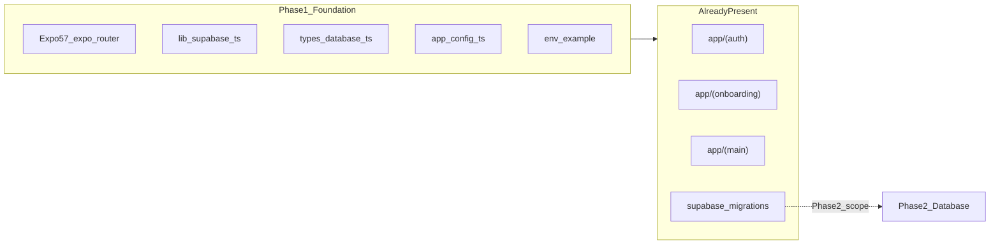

# Side Quest — Phase 1: Foundation & Project Scaffold (Detailed Plan)

## Phase 0 intent (scope boundary)

From [docs/plans/side_quest_phase_0_50bd8a65.plan.md](docs/plans/side_quest_phase_0_50bd8a65.plan.md):

> **Goal:** Runnable Expo app shell connected to Supabase client (**no features yet**).

**In scope for Phase 1**

- Expo + TypeScript + `expo-router` project
- Typed Supabase client wired to env
- Hand-written (or generated) DB types stub
- `.env.example` + gitignored `.env`
- App config: bundle IDs, OAuth scheme, location permission strings
- Target folder layout (`app/`, `lib/`, `hooks/`, `types/`, `components/`)
- `README.md` with local run commands

**Explicitly out of scope (later phases)**

- Supabase migrations / RLS / RPCs → **Phase 2**
- Auth screens (Google, Apple, phone) → **Phase 3**
- Venue, check-in, room, chat screens → **Phases 4–7**

---

## Current codebase audit

The repo is **not** a pure Phase 1 shell. A prior session implemented Phases 1–9 together. Phase 1 deliverables map as follows:

| Phase 1 deliverable | Status | Existing path |
|---------------------|--------|-----------------|
| Expo + expo-router + TS | Done | [package.json](package.json), [app/_layout.tsx](app/_layout.tsx) |
| `lib/supabase.ts` typed client | Done | [lib/supabase.ts](lib/supabase.ts) — `createClient<Database>`, AsyncStorage auth, placeholder fallback |
| `types/database.ts` | Done | [types/database.ts](types/database.ts) — full schema types (ahead of Phase 1 minimum) |
| `.env.example` | Done | [.env.example](.env.example) |
| App config (bundle IDs, scheme, location) | Done (variant) | [app.config.ts](app.config.ts) replaces Phase 0's `app.json` |
| Folder layout | Done (expanded) | `app/(auth|onboarding|main)/`, `lib/`, `hooks/`, `contexts/`, `components/` |
| `README.md` | Done | [README.md](README.md) |
| **Shell only, no features** | **Gap** | [app/index.tsx](app/index.tsx) routes to auth/onboarding/main; full feature routes exist |
| `lib/geo.ts`, `lib/connections.ts` stubs | Ahead of plan | Fully implemented in [lib/geo.ts](lib/geo.ts), [lib/connections.ts](lib/connections.ts) |
| `supabase/migrations/` | Phase 2 scope | 5 migration files already committed |
| Styling choice (NativeWind default) | Divergence | StyleSheet + [constants/theme.ts](constants/theme.ts) (acceptable; document decision) |

**Conclusion:** Do **not** re-scaffold. Phase 1 work = **validate foundation + reconcile documentation + optional shell hardening** before treating Phase 2 as the next execution step.



---

## Recommended approach

**Validate-and-reconcile** (not greenfield rebuild):

1. Confirm Phase 1 exit criteria pass on current tree
2. Fix small foundation gaps (scripts, docs, config clarity)
3. Document intentional divergences from Phase 0
4. Freeze Phase 1 boundary: no new feature work until Phase 2 checklist starts

Alternative (not recommended): strip `app/(auth|onboarding|main)` back to a single placeholder screen — high churn, no user benefit since later phases are already coded.

---

## Implementation steps

### Step 1 — Verify project boots (validation core)

Run from repo root:

```bash
npm install
npx tsc --noEmit
npx expo config --type public
npm start
```

**Pass criteria**

- Metro starts without config errors
- App loads on iOS simulator or Android emulator
- No crash on launch with placeholder Supabase keys ([lib/supabase.ts](lib/supabase.ts) fallbacks)

### Step 2 — Confirm Supabase client wiring

Review [lib/supabase.ts](lib/supabase.ts):

- `EXPO_PUBLIC_*` vars read via [app.config.ts](app.config.ts) `extra` + env
- `isSupabaseConfigured` flag used on auth screen for dev warning
- `react-native-url-polyfill` imported before client creation

**Optional hardening (small diff)**

- Add a minimal `lib/healthcheck.ts` that calls `supabase.auth.getSession()` on app mount and logs success/failure (no UI beyond existing loading state)

### Step 3 — Reconcile app config vs Phase 0 spec

Phase 0 lists `app.json`; repo uses [app.config.ts](app.config.ts) only (no root `app.json`). **Accept `app.config.ts` as canonical** — it already includes:

- `scheme: sidequest` (OAuth redirects)
- `bundleIdentifier` / `package`: `com.sidequest.app`
- Location permission strings (needed by Phase 4, harmless in Phase 1)
- `expo-router`, `expo-splash-screen` plugins

**Action:** Add a one-line note to [README.md](README.md) that config lives in `app.config.ts`, not `app.json`.

### Step 4 — Lock folder layout and path aliases

Confirm [tsconfig.json](tsconfig.json) `@/*` paths resolve to repo root (already set).

Target layout from Phase 0 vs actual:

```text
app/           ✓ (route groups pre-created for later phases)
components/    ✓
lib/           ✓ supabase.ts + (geo, connections ahead of schedule)
hooks/         ✓
types/         ✓
supabase/      present (Phase 2 — do not modify in Phase 1)
.env.example   ✓
package.json   ✓
```

No structural moves required.

### Step 5 — Environment and secrets hygiene

- [.env.example](.env.example) — present with `EXPO_PUBLIC_SUPABASE_URL`, `EXPO_PUBLIC_SUPABASE_ANON_KEY`, `EXPO_PUBLIC_APP_SCHEME`
- [.gitignore](.gitignore) — confirm `.env` is ignored (already added)

**User action (not blocking Phase 1 validation):** `cp .env.example .env` when ready for live Supabase.

### Step 6 — Foundation npm scripts

Add to [package.json](package.json) scripts (small quality-of-life):

```json
"typecheck": "tsc --noEmit"
```

Keeps Phase 1 validation repeatable without memorizing `npx tsc`.

### Step 7 — Document styling decision

Phase 0 defaulted NativeWind; implementation uses StyleSheet via [constants/theme.ts](constants/theme.ts) and [components/ui.tsx](components/ui.tsx).

**Action:** Record in [README.md](README.md) or [.cursor/memory/runbooks/sidequest-mvp.md](.cursor/memory/runbooks/sidequest-mvp.md): "StyleSheet chosen over NativeWind to reduce Phase 1 toolchain surface."

No NativeWind install unless you explicitly want to pivot.

### Step 8 — Clean leftover Expo template artifacts (optional)

Low-priority removals if desired:

- [app/+html.tsx](app/+html.tsx), [app/+not-found.tsx](app/+not-found.tsx) — keep (expo-router defaults)
- Unused tab scaffold components in [components/](components/) (`EditScreenInfo.tsx`, `Themed.tsx`, etc.) — optional delete in Phase 1 or defer to a polish pass

### Step 9 — Update project state docs

After validation passes, update:

- [.cursor/STATE.md](.cursor/STATE.md) — objective: "Phase 1 complete; ready for Phase 2"
- [.cursor/memory/memories/2026-07-09-continuation.md](.cursor/memory/memories/2026-07-09-continuation.md) — append validation commands + result

---

## Phase 1 exit checklist

- [ ] `npm install` succeeds
- [ ] `npm run typecheck` (or `npx tsc --noEmit`) passes
- [ ] `npx expo config --type public` shows `name: Side Quest`, `scheme: sidequest`
- [ ] `npm start` launches app on iOS or Android without crash (placeholder keys OK)
- [ ] [lib/supabase.ts](lib/supabase.ts) initializes; `isSupabaseConfigured` reflects env state
- [ ] [.env.example](.env.example) committed; `.env` gitignored
- [ ] [README.md](README.md) documents `app.config.ts` and local run commands
- [ ] Divergences documented: `app.config.ts` over `app.json`, StyleSheet over NativeWind, feature routes pre-built

---

## Handoff to Phase 2

Once Phase 1 checklist is green, **stop app feature work** and begin [Phase 2 — Database, RLS & Supabase project link](docs/plans/side_quest_phase_0_50bd8a65.plan.md):

1. `supabase login` + `supabase link --project-ref <ref>`
2. `supabase db push --linked --yes` (migrations already in [supabase/migrations/](supabase/migrations/))
3. `supabase db execute -f supabase/seed.sql --linked`
4. Verify RLS + RPC smoke tests in SQL editor

Phase 2 does **not** require Phase 1 code changes beyond a working Supabase client.

---

## Risk notes

| Risk | Mitigation |
|------|------------|
| Scope confusion (Phase 1 vs full MVP already built) | Use exit checklist; treat pre-built routes as forward-compatible structure, not Phase 1 deliverables |
| `app.json` expected by some tooling | `app.config.ts` is Expo-canonical; `npx expo config` is source of truth |
| Placeholder Supabase keys | Expected until Phase 9 secrets; app must boot without network calls on launch |
| Simulator location for later phases | Not a Phase 1 blocker; seed venues are Sydney CBD (documented in Phase 4) |

---

## Estimated effort

- **If validating only (current repo):** ~30–60 minutes (run checks, minor README/script updates)
- **If greenfield (not needed):** ~2–3 hours — skip; repo already past this point
