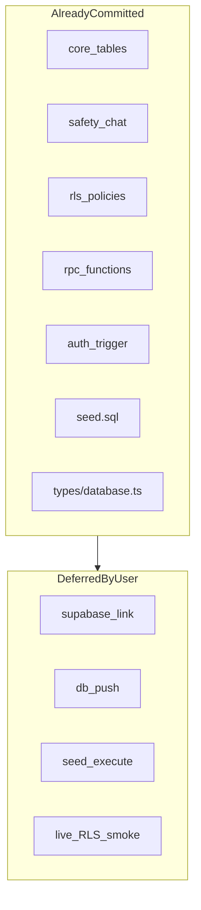

# Side Quest — Phase 2: Database, RLS & Supabase Project Link (Detailed Plan)

## Phase 1 handoff (complete)

Per [docs/plans/side_quest_phase_1_3e2db27c.plan.md](docs/plans/side_quest_phase_1_3e2db27c.plan.md) and [.cursor/STATE.md](.cursor/STATE.md):

- Expo shell + typed Supabase client: green
- `supabase init` done; **5 migrations + seed committed**; **not linked** to a remote project
- **Your choice:** defer remote `link` / `db push` until credentials are ready

Phase 2 therefore splits into **(A) repo-side schema hardening now** and **(B) remote apply later** when you provide project ref + `.env` keys.

---

## Phase 0 intent (scope boundary)

From [docs/plans/side_quest_phase_0_50bd8a65.plan.md](docs/plans/side_quest_phase_0_50bd8a65.plan.md):

> **Goal:** Full schema + policies on hosted Supabase.

**In scope**

| # | Migration | Repo file | Contents |
|---|-----------|-----------|----------|
| 1 | core_tables | [supabase/migrations/20260709164000_core_tables.sql](supabase/migrations/20260709164000_core_tables.sql) | profiles, venues, check_ins, connections (+ mutual-match flags) |
| 2 | safety_chat | [supabase/migrations/20260709164001_safety_chat.sql](supabase/migrations/20260709164001_safety_chat.sql) | blocks, messages, reports |
| 3 | rls_policies | [supabase/migrations/20260709164002_rls_policies.sql](supabase/migrations/20260709164002_rls_policies.sql) | RLS on all tables |
| 4 | rpc_functions | [supabase/migrations/20260709164003_rpc_functions.sql](supabase/migrations/20260709164003_rpc_functions.sql) | counts, peers, connect, block, checkout |
| 5 | auth_trigger | [supabase/migrations/20260709164004_auth_trigger.sql](supabase/migrations/20260709164004_auth_trigger.sql) | profile on signup, updated_at |
| — | seed | [supabase/seed.sql](supabase/seed.sql) | 5 Sydney CBD venues |

**Out of scope (later phases)**

- Auth provider dashboard config → Phase 3 / Phase 9
- App screen changes → Phases 3–8
- `.env` secrets collection → Phase 9 (partial overlap when push happens)

---

## Current codebase audit



| Item | Status | Notes |
|------|--------|-------|
| Migration files (5) | Done | Match Phase 0 design; timestamps pre-CLI-hang |
| `supabase/config.toml` | Done | From `supabase init` |
| Remote link (`project-ref`) | **Not done** | Deferred |
| `db push --linked` | **Not done** | Deferred |
| Seed applied remotely | **Not done** | Deferred |
| Realtime on `messages` / `check_ins` | **Missing** | Only documented in [docs/PHASE9_SETUP.md](docs/PHASE9_SETUP.md); not in SQL |
| Seed idempotency | **Bug** | [supabase/seed.sql](supabase/seed.sql) uses `on conflict do nothing` but `venues` has no matching unique constraint — re-run duplicates rows |
| RLS smoke tests | **Missing** | Phase 0 validation requires SQL editor tests; no script in repo |
| Generated types | Optional | Hand-written [types/database.ts](types/database.ts) exists; regen after push |

---

## Recommended approach (deferred push)

**Do now (no credentials required)**

1. Audit migrations against Phase 0 privacy model
2. Add **migration 006** for Realtime publication + venue seed uniqueness
3. Fix **seed.sql** for idempotent re-runs
4. Add **validation SQL** under `supabase/tests/` for RLS/RPC smoke tests (run post-push)
5. Document deferred push runbook section + update STATE/MEMORY

**Do when credentials available** (documented, not blocking Phase 2 exit)

```bash
cp .env.example .env   # fill URL + anon key
supabase login
supabase link --project-ref <ref> --yes
supabase db push --linked --yes
supabase db execute -f supabase/seed.sql --linked
supabase migration list --linked
```

Follow [.cursor/skills/supabase-linked-migrations/SKILL.md](.cursor/skills/supabase-linked-migrations/SKILL.md).

---

## Implementation steps

### Step 1 — Migration audit (read-only review)

Confirm alignment with Phase 0 privacy principles:

| Table | Expected | Current [20260709164002_rls_policies.sql](supabase/migrations/20260709164002_rls_policies.sql) |
|-------|----------|----------------------------------|
| profiles | Owner CRUD only; no public SELECT | `profiles_select_own` — OK |
| check_ins | Owner only; no room listing | Owner CRUD — OK; discovery via `get_room_peers` RPC |
| venues | Public read | `venues_select_all` — OK |
| connections | Participants read/update | OK; writes via `request_connection` (security definer) |
| messages | Connected participants | OK |
| blocks / reports | Owner scoped | OK |

**RPC audit** ([20260709164003_rpc_functions.sql](supabase/migrations/20260709164003_rpc_functions.sql)):

- `venue_active_check_in_counts` — granted to `authenticated, anon` (venue vibe counts before full auth is possible)
- `get_room_peers` — `authenticated` only; filters venue+mode, blocks, expiry
- `request_connection`, `block_user`, `checkout_user` — security definer; canonical pair `user_one < user_two`

No structural rewrites expected unless audit finds a gap.

### Step 2 — Fix seed idempotency

**Problem:** `on conflict do nothing` in [supabase/seed.sql](supabase/seed.sql) has no conflict target.

**Fix (new migration `20260709164005_realtime_and_seed_fix.sql`):**

```sql
-- Unique dev venues by name + coords (idempotent seed)
alter table public.venues
  add constraint venues_name_location_unique unique (name, latitude, longitude);
```

Update [supabase/seed.sql](supabase/seed.sql):

```sql
insert into public.venues (name, latitude, longitude) values (...)
on conflict on constraint venues_name_location_unique do nothing;
```

### Step 3 — Add Realtime publication (migration 006)

App subscribes to `check_ins` ([app/(main)/room.tsx](app/(main)/room.tsx)) and `messages` ([app/(main)/chat/[connectionId].tsx](app/(main)/chat/[connectionId].tsx)). Codify in migration instead of dashboard-only:

```sql
alter publication supabase_realtime add table public.messages;
alter publication supabase_realtime add table public.check_ins;
```

Use `add table ...` only if not already in publication (wrap in DO block or document one-time apply). Place in same `20260709164005_*` migration file.

### Step 4 — Add validation SQL scripts

Create [supabase/tests/phase2_smoke.sql](supabase/tests/phase2_smoke.sql) — runnable in SQL Editor **after** push:

**Checks to include**

1. Tables exist: `profiles`, `venues`, `check_ins`, `connections`, `blocks`, `messages`, `reports`
2. Functions exist: `venue_active_check_in_counts`, `get_room_peers`, `request_connection`, `block_user`, `checkout_user`
3. Seed venues: `select count(*) from venues` → 5
4. RLS enabled on all public tables
5. **Privacy probe (as anon/authenticated test user):** `select * from profiles` returns only own row (or zero rows without auth)
6. RPC: `select * from venue_active_check_in_counts()` returns rows (empty counts OK)

Create [supabase/tests/README.md](supabase/tests/README.md) with run instructions.

### Step 5 — Optional type generation script

Add npm script (no execution until linked):

```json
"db:types": "supabase gen types typescript --linked > types/database.generated.ts"
```

Document in README: hand-written [types/database.ts](types/database.ts) is canonical until first `db:types` run; compare diff after push.

### Step 6 — Documentation updates

| File | Update |
|------|--------|
| [README.md](README.md) | Phase 2 section: migration list, deferred push steps, `supabase/tests/` |
| [.cursor/memory/runbooks/sidequest-mvp.md](.cursor/memory/runbooks/sidequest-mvp.md) | Phase 2 validation + seed fix + Realtime migration |
| [.cursor/STATE.md](.cursor/STATE.md) | Objective: Phase 2 repo complete; remote push deferred |
| [docs/PHASE9_SETUP.md](docs/PHASE9_SETUP.md) | Cross-link Phase 2 smoke tests; note migration 006 |

### Step 7 — Remote apply (deferred — runbook only)

When you are ready, agent or you runs:

```bash
supabase login
supabase link --project-ref <ref> --yes
supabase db push --linked --yes
supabase db execute -f supabase/seed.sql --linked
supabase migration list --linked   # Local = Remote for all 6 versions
```

Then run [supabase/tests/phase2_smoke.sql](supabase/tests/phase2_smoke.sql) in SQL Editor.

Copy URL + anon key to `.env`; restart Expo — [lib/healthcheck.ts](lib/healthcheck.ts) should log `configured: true`.

---

## Phase 2 exit checklist

**Repo-side (complete without credentials)**

- [ ] Migration audit documented (no blocking issues)
- [ ] Migration `20260709164005` adds venue unique constraint + Realtime tables
- [ ] [supabase/seed.sql](supabase/seed.sql) idempotent via named constraint
- [ ] [supabase/tests/phase2_smoke.sql](supabase/tests/phase2_smoke.sql) + README added
- [ ] README / runbook / STATE updated
- [ ] `npm run typecheck` still passes (no app breakage)

**Remote-side (deferred — run when ready)**

- [ ] `supabase link` + `db push --linked --yes`
- [ ] `supabase migration list --linked` — all local versions match remote
- [ ] Seed applied — 5 venues visible
- [ ] `phase2_smoke.sql` passes in SQL Editor
- [ ] `.env` populated; app connects to live project

---

## Handoff to Phase 3

Phase 3 (Auth screens) can proceed **in parallel with deferred push** for UI work, but **live auth testing** requires:

- Remote DB pushed (profiles trigger on `auth.users`)
- `.env` with real Supabase URL + anon key
- Auth providers enabled in Supabase dashboard (Phase 9 docs)

Minimum to start Phase 3 UI-only: no DB changes. Minimum to **validate** Phase 3: complete deferred push checklist above.

---

## Risks and mitigations

| Risk | Mitigation |
|------|------------|
| `db push` fails on fresh project | Migrations ordered; policies use `drop policy if exists` pattern |
| Realtime `add table` already exists | Use conditional DO block or ignore duplicate error on re-push |
| Seed duplicates before fix migration | Run seed only once pre-fix; migration 005+ fixes forward |
| macOS Supabase CLI hang | Use `npx`-based `supabase` per [.cursor/TOOLS.md](.cursor/TOOLS.md) |
| Hand-written types drift from remote | Run `db:types` after first successful push |

---

## Estimated effort

- **Repo hardening (deferred-push path):** ~1–2 hours
- **Remote apply (when credentials ready):** ~15–30 minutes
