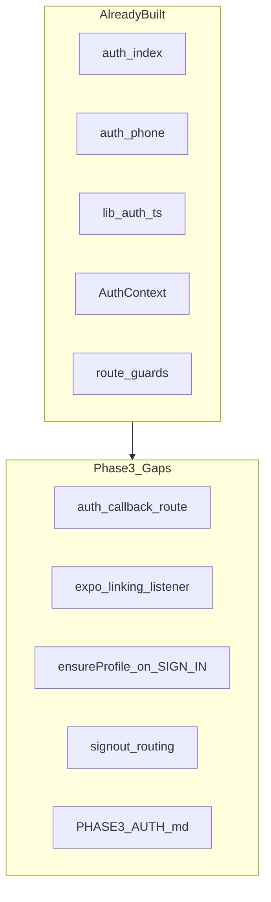
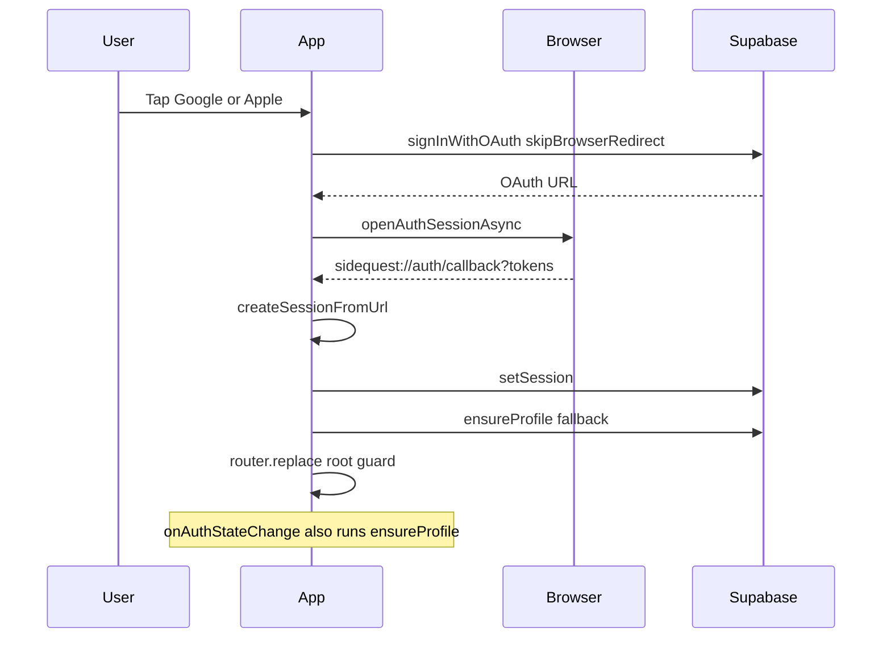

# Side Quest — Phase 3: Authentication & Screen 1 (Detailed Plan)

## Phase 2 handoff

Per [docs/plans/side_quest_phase_2_b9bd148d.plan.md](docs/plans/side_quest_phase_2_b9bd148d.plan.md) and [.cursor/STATE.md](.cursor/STATE.md):

- 6 migrations + seed + smoke tests committed; **remote `db push` deferred**
- **Your choice:** Phase 3 = **repo-side hardening only** (no live auth on device yet)

Live auth validation requires: `.env` keys, `db push`, auth providers in Supabase dashboard, and `handle_new_user` trigger on remote DB.

---

## Phase 0 intent (scope boundary)

From [docs/plans/side_quest_phase_0_50bd8a65.plan.md](docs/plans/side_quest_phase_0_50bd8a65.plan.md):

> **Goal:** Working sign-up/sign-in for all three providers.

**In scope**

- Hero screen: Google, Apple (iOS), phone OTP
- OAuth deep-link / redirect handling
- Session listener → route to onboarding or main
- Profile row on signup (DB trigger + client `ensureProfile` fallback)
- Supabase Auth provider setup **documented** (secrets applied when ready)

**Out of scope**

- Venue / check-in / room / chat changes → Phases 4–7
- Full OAuth dashboard configuration execution → deferred until credentials (overlap with [docs/PHASE9_SETUP.md](docs/PHASE9_SETUP.md))
- Native `expo-apple-authentication` (optional post-MVP; browser OAuth is sufficient for MVP)

---

## Current codebase audit

Auth was implemented ahead of strict phasing (same pattern as Phase 1–2).

| Phase 3 deliverable | Status | Path |
|---------------------|--------|------|
| Hero UI | Done | [app/(auth)/index.tsx](app/(auth)/index.tsx) |
| Phone OTP screen | Done | [app/(auth)/phone.tsx](app/(auth)/phone.tsx) |
| OAuth helper | Done | [lib/auth.ts](lib/auth.ts) — `signInWithOAuth`, `createSessionFromUrl` |
| Phone helpers | Done | `signInWithPhone`, `verifyPhoneOtp` |
| Profile fallback | Partial | [lib/auth.ts](lib/auth.ts) `ensureProfile()` — only called from screens |
| Session listener | Done | [contexts/AuthContext.tsx](contexts/AuthContext.tsx) `onAuthStateChange` |
| Route guards | Done | [app/index.tsx](app/index.tsx), [app/(auth)/_layout.tsx](app/(auth)/_layout.tsx) |
| Scheme / redirect URI | Partial | [lib/auth.ts](lib/auth.ts) `redirectTo` = `sidequest://auth/callback` |
| **OAuth callback route** | **Gap** | No `app/auth/callback.tsx` — cold-start deep links not handled |
| **URL listener (cold start)** | **Gap** | No `expo-linking` listener in root layout |
| **Profile on session restore** | **Gap** | `ensureProfile` not tied to `SIGNED_IN` in AuthProvider |
| **Sign-out navigation** | **Gap** | [app/(main)/room.tsx](app/(main)/room.tsx) calls `signOut()` but does not `router.replace('/(auth)')` |
| **OAuth cancel UX** | **Gap** | Dismissed browser returns `null` silently |
| Provider setup docs | **Gap** | Scattered in PHASE9; no Phase 3-focused auth guide |
| Accessibility on auth buttons | **Gap** | No `accessibilityLabel` on hero actions |



**Conclusion:** Validate-and-reconcile (not rebuild). Add callback plumbing, tighten session lifecycle, document provider setup, defer live testing.

---

## Auth flow (target)



---

## Implementation steps

### Step 1 — Add OAuth callback route

Create [app/auth/callback.tsx](app/auth/callback.tsx) (matches `redirectTo` path `auth/callback`):

- Read URL via `useLocalSearchParams` or `Linking.useURL()`
- Call `createSessionFromUrl(url)` from [lib/auth.ts](lib/auth.ts)
- On success: `ensureProfile()` → `router.replace('/')`
- On failure: show error + link back to `/(auth)`

Expo Router maps `sidequest://auth/callback` to this file when scheme is `sidequest` ([app.config.ts](app.config.ts)).

### Step 2 — Cold-start deep link listener

In [app/_layout.tsx](app/_layout.tsx) (or a small `hooks/useAuthDeepLink.ts`):

```typescript
import * as Linking from 'expo-linking';
// On mount: Linking.getInitialURL() → createSessionFromUrl if matches auth/callback
// Subscribe: Linking.addEventListener('url', handler)
```

Prevents lost sessions when the app opens from OAuth redirect instead of in-app browser return.

### Step 3 — Harden AuthProvider session lifecycle

Update [contexts/AuthContext.tsx](contexts/AuthContext.tsx):

- On `onAuthStateChange` with `event === 'SIGNED_IN'`: call `ensureProfile()` then `refreshCheckIn()`
- On `SIGNED_OUT`: clear `checkIn` (already partial via `signOut`)
- Export typed auth loading states if needed for callback screen

Keeps profile row creation reliable even when trigger is not yet on remote DB (client fallback always runs).

### Step 4 — Sign-out routing

Update [contexts/AuthContext.tsx](contexts/AuthContext.tsx) or [app/(main)/room.tsx](app/(main)/room.tsx):

- After `supabase.auth.signOut()`, navigate to `/(auth)` via `router.replace`
- Prefer centralizing in `signOut()` inside AuthProvider using `expo-router` (inject router or use imperative API)

Ensures user lands on hero immediately, not stale main stack.

### Step 5 — OAuth and phone UX polish

In [app/(auth)/index.tsx](app/(auth)/index.tsx):

- If `signInWithOAuth` returns `null` (user cancelled): optional subtle message, not an error
- Add `accessibilityLabel` / `accessibilityRole="button"` on all three sign-in buttons
- Disable buttons while `!isSupabaseConfigured` (not just banner)

In [app/(auth)/phone.tsx](app/(auth)/phone.tsx):

- Validate E.164-ish format before send (must start with `+` and min length)
- Add "Change number" action when `sent === true`
- Accessibility labels on inputs and buttons

### Step 6 — Provider setup documentation

Create [docs/PHASE3_AUTH.md](docs/PHASE3_AUTH.md) (Phase 3 canonical; PHASE9 links here):

**Sections**

1. Prerequisites: `.env` filled, Phase 2 `db push` complete
2. **Redirect URLs** to add in Supabase Auth settings:
   - `sidequest://auth/callback`
   - Expo dev URI from `npx expo start` (document how to copy `makeRedirectUri` output in dev)
3. **Phone OTP**: enable provider, Twilio vs test numbers
4. **Google**: Web client ID → `EXPO_PUBLIC_GOOGLE_WEB_CLIENT_ID`; Supabase Google provider config; iOS/Android client IDs for store builds (pointer to Phase 9)
5. **Apple (iOS)**: Supabase Apple provider; Services ID; note browser OAuth flow used in MVP
6. **Validation order when credentials ready**: phone first → Google → Apple
7. Cross-link [supabase/migrations/20260709164004_auth_trigger.sql](supabase/migrations/20260709164004_auth_trigger.sql) for profile auto-create

Update [README.md](README.md) with Phase 3 pointer and auth test prerequisites.

### Step 7 — Repo-side validation (no live Supabase)

Run without credentials:

```bash
npm run typecheck
```

Manual code review checklist:

- [ ] `redirectTo` path matches `app/auth/callback.tsx` route
- [ ] `AuthProvider` calls `ensureProfile` on `SIGNED_IN`
- [ ] Sign-out returns to auth stack
- [ ] Hero shows config warning when placeholder keys
- [ ] Phone screen handles send → verify → redirect flow in code paths

Optional: add `lib/auth.test.ts` only if project already has a test runner (it does not — **skip** adding test framework in Phase 3).

### Step 8 — Update project state docs

| File | Update |
|------|--------|
| [.cursor/STATE.md](.cursor/STATE.md) | Phase 3 repo complete; live auth deferred |
| [.cursor/memory/runbooks/sidequest-mvp.md](.cursor/memory/runbooks/sidequest-mvp.md) | Phase 3 auth hardening section |
| [.cursor/memory/memories/2026-07-09-continuation.md](.cursor/memory/memories/2026-07-09-continuation.md) | Append Phase 3 ops |

---

## Phase 3 exit checklist

**Repo-side (complete without credentials)**

- [ ] `app/auth/callback.tsx` handles OAuth return URL
- [ ] Cold-start `Linking` listener processes auth callback
- [ ] `AuthProvider` runs `ensureProfile` on `SIGNED_IN`
- [ ] Sign-out navigates to `/(auth)`
- [ ] Hero + phone UX polish (cancel handling, a11y labels, phone validation)
- [ ] [docs/PHASE3_AUTH.md](docs/PHASE3_AUTH.md) created; README linked
- [ ] `npm run typecheck` passes

**Live validation (deferred — run when ready)**

- [ ] Phase 2 remote push complete (`handle_new_user` trigger live)
- [ ] `.env` has real `EXPO_PUBLIC_SUPABASE_*`
- [ ] Phone OTP: send + verify on simulator/device
- [ ] Google OAuth: full browser flow on iOS + Android
- [ ] Apple OAuth: full flow on iOS simulator/device
- [ ] Session persists after app reload (`AsyncStorage`)
- [ ] New user gets `profiles` row (trigger or fallback)
- [ ] Signed-in user redirects: no check-in → venue; has check-in → room

---

## Handoff to Phase 4

Phase 4 (venue picker) depends on:

- Authenticated session (Phase 3)
- `venues` table + `venue_active_check_in_counts` RPC on remote DB (Phase 2 push)

UI for [app/(onboarding)/venue.tsx](app/(onboarding)/venue.tsx) already exists; Phase 4 work is GPS gate, RPC wiring validation, and tooltips — not auth changes.

---

## Risks and mitigations

| Risk | Mitigation |
|------|------------|
| OAuth redirect mismatch | Single source: `redirectTo` in `lib/auth.ts`; document exact URIs in PHASE3_AUTH |
| Expo Go vs dev build scheme differences | Document `makeRedirectUri` dev output in PHASE3_AUTH |
| Profile insert fails without remote DB | Client `ensureProfile` on `SIGNED_IN`; warn in docs that push is required for RLS insert |
| Apple review prefers native Sign in with Apple | MVP uses browser OAuth; note upgrade path to `expo-apple-authentication` |
| Duplicate ensureProfile + trigger | `on conflict do nothing` in trigger; client checks `maybeSingle` before insert |

---

## Estimated effort

- **Repo hardening (your chosen path):** ~1–2 hours
- **Live validation (deferred):** ~1–2 hours when credentials + Phase 2 push ready
