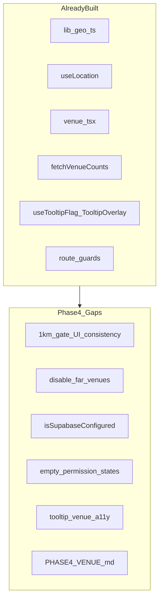
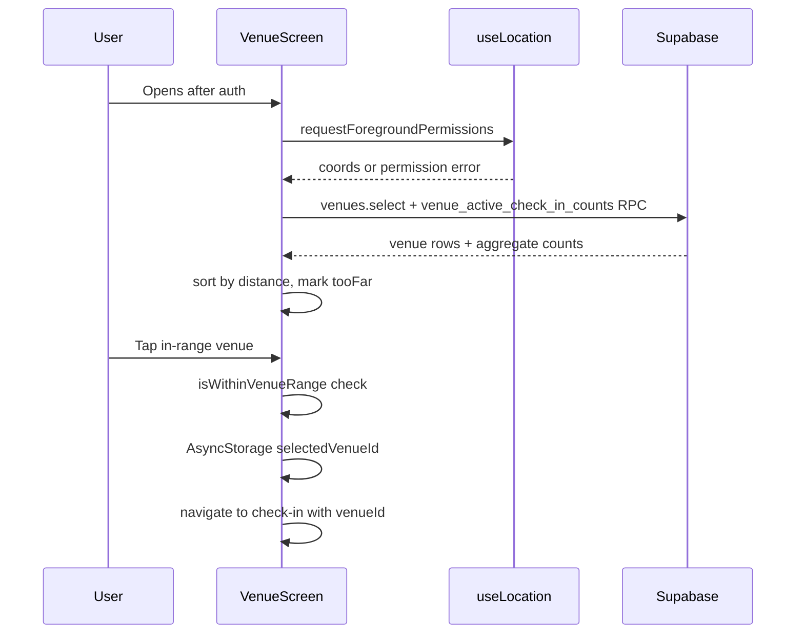

# Side Quest — Phase 4: Venue Selection, Proximity & Tooltips (Detailed Plan)

## Phase 3 handoff

Per [docs/plans/side_quest_phase_3_b24487cb.plan.md](docs/plans/side_quest_phase_3_b24487cb.plan.md) and [.cursor/STATE.md](.cursor/STATE.md):

- Phase 3 repo-side complete: OAuth callback, deep link listener, `ensureProfile` on `SIGNED_IN`, sign-out routing, `docs/PHASE3_AUTH.md`
- Phase 2 remote `db push` still **deferred**
- **Your choice:** Phase 4 = **repo-side hardening only** (no live simulator GPS / venue RPC testing yet)

Live Phase 4 validation requires: authenticated session (Phase 3 live), remote DB with seed venues, and simulator location set near Sydney CBD seed coords.

---

## Phase 0 intent (scope boundary)

From [docs/plans/side_quest_phase_0_50bd8a65.plan.md](docs/plans/side_quest_phase_0_50bd8a65.plan.md):

> **Goal:** GPS-gated venue picker with vibe counts.

**In scope**

- [`lib/geo.ts`](lib/geo.ts) — Haversine distance, 1 km check
- [`hooks/useLocation.ts`](hooks/useLocation.ts) — permission + coords
- [`app/(onboarding)/venue.tsx`](app/(onboarding)/venue.tsx) — venue list, distance sort, selection gate
- Fetch `venues` + `venue_active_check_in_counts` RPC
- First-visit tooltip (`AsyncStorage` flag) via [`hooks/useTooltipFlag.ts`](hooks/useTooltipFlag.ts) + [`components/TooltipOverlay.tsx`](components/TooltipOverlay.tsx)
- Blocked UX when venue > 1 km
- Phase 4-focused docs (simulator GPS, seed coords, deferred validation)

**Out of scope**

- Check-in form / profile fields / `check_ins` insert logic → Phase 5 ([`app/(onboarding)/check-in.tsx`](app/(onboarding)/check-in.tsx) already exists; only validate `venueId` param handoff)
- Room deck, connections, chat → Phases 6–7
- Auth changes → Phase 3 (complete)
- New test framework → skip (no runner in repo, same as Phase 3)

---

## Current codebase audit

Venue picker was implemented ahead of strict phasing (same pattern as Phases 1–3).

| Phase 4 deliverable | Status | Path |
|---------------------|--------|------|
| Haversine + 1 km helper | Done | [`lib/geo.ts`](lib/geo.ts) — uses `VENUE_MAX_DISTANCE_KM` from [`constants/theme.ts`](constants/theme.ts) |
| Location hook | Done | [`hooks/useLocation.ts`](hooks/useLocation.ts) — foreground permission + `getCurrentPositionAsync` |
| Location permission strings | Done | [`app.config.ts`](app.config.ts) — iOS + Android |
| Venue screen UI | Done | [`app/(onboarding)/venue.tsx`](app/(onboarding)/venue.tsx) |
| Venues fetch | Done | `supabase.from('venues').select('*')` — RLS `venues_select_all` allows public read |
| Counts RPC | Done | [`lib/connections.ts`](lib/connections.ts) `fetchVenueCounts()` → `venue_active_check_in_counts` |
| Distance sort + display | Done | `venuesWithDistance` memo, `formatDistanceKm` |
| 1 km gate on select | Done | `isWithinVenueRange` in `selectVenue` |
| First-visit tooltip | Done | `useTooltipFlag('venue')` + `TooltipOverlay` |
| Route to check-in | Done | `router.push('/(onboarding)/check-in', { venueId })` + `SELECTED_VENUE_KEY` in AsyncStorage |
| Root guard → venue | Done | [`app/index.tsx`](app/index.tsx) redirects signed-in users without check-in |
| **1 km constant in UI** | **Gap** | `tooFar` uses hardcoded `> 1` instead of `VENUE_MAX_DISTANCE_KM` |
| **Far venue interaction** | **Gap** | Cards styled dim but still pressable; error only after tap |
| **Supabase config guard** | **Gap** | Auth screens use `isSupabaseConfigured`; venue screen does not |
| **Empty / error states** | **Gap** | No `ListEmptyComponent` when seed empty; permission denied has no settings affordance |
| **Tooltip a11y** | **Gap** | `TooltipOverlay` dismiss lacks `accessibilityRole` / `accessibilityLabel` |
| **Venue card a11y** | **Partial** | `accessibilityLabel` present; missing `accessibilityState={{ disabled }}` for far venues |
| **Venue data module** | **Optional** | Fetch logic inline in screen; could extract `lib/venues.ts` for clarity |
| **Phase 4 docs** | **Gap** | No `docs/PHASE4_VENUE.md`; simulator GPS only mentioned briefly in README |



**Conclusion:** Validate-and-reconcile (not rebuild). Tighten proximity UX, harden data-fetch edge cases, document simulator testing, defer live GPS validation.

---

## Target flow



---

## Implementation steps

### Step 1 — Harden 1 km gate consistency

In [`app/(onboarding)/venue.tsx`](app/(onboarding)/venue.tsx):

- Replace hardcoded `item.distanceKm > 1` with `!isWithinVenueRange(coords, venue)` or compare against `VENUE_MAX_DISTANCE_KM`
- Disable `Pressable` when `tooFar` or `!coords` (`disabled={tooFar || !coords}`)
- Add `accessibilityState={{ disabled: tooFar || !coords }}` on venue cards
- Keep `distanceError` banner for explicit feedback when user attempts blocked selection (belt-and-suspenders if disabled state is bypassed)

Ensures UI gate and `selectVenue` logic share one constant from [`constants/theme.ts`](constants/theme.ts).

### Step 2 — Venue + counts data layer

**Option A (minimal):** Keep fetch in screen; improve error handling.

**Option B (recommended):** Add [`lib/venues.ts`](lib/venues.ts):

```typescript
export async function fetchVenues(): Promise<Venue[]>
export async function loadVenuePickerData(): Promise<{ venues: Venue[]; counts: Record<string, number> }>
```

- `loadVenuePickerData` parallelizes `venues.select` + `fetchVenueCounts()` (same as today)
- Venue screen calls one function; easier to test/review

In [`app/(onboarding)/venue.tsx`](app/(onboarding)/venue.tsx):

- Show config warning when `!isSupabaseConfigured` (mirror auth screens)
- Disable list refresh / selection when unconfigured
- Add `ListEmptyComponent`: "No venues found — run seed after db push"
- Differentiate load error vs empty result

RPC wiring to verify (code review, no live DB needed):

- [`supabase/migrations/20260709164003_rpc_functions.sql`](supabase/migrations/20260709164003_rpc_functions.sql) — `venue_active_check_in_counts` returns `(venue_id, active_count)` for non-expired check-ins only
- Missing venues in RPC result correctly default to `0` via `counts[item.id] ?? 0` (already correct)

### Step 3 — Location permission UX

In [`hooks/useLocation.ts`](hooks/useLocation.ts) and/or venue screen:

- Export `permissionGranted` (already returned) for conditional UI
- When permission denied: show actionable copy + optional `Linking.openSettings()` button (iOS/Android) via ghost `Button`
- Keep existing "Refresh location" footer action

No background location changes in Phase 4 — that belongs to Phase 7 [`hooks/useAutoCheckout.ts`](hooks/useAutoCheckout.ts).

### Step 4 — Tooltip and accessibility polish

In [`components/TooltipOverlay.tsx`](components/TooltipOverlay.tsx):

- Add `accessibilityRole="button"` and `accessibilityLabel="Dismiss tooltip"` on "Got it"
- Optional: `accessibilityViewIsModal` on backdrop

In [`app/(onboarding)/venue.tsx`](app/(onboarding)/venue.tsx):

- Enrich venue card `accessibilityLabel` to include distance and too-far state
- Ensure "Refresh location" uses `accessibilityLabel`

### Step 5 — Phase 4 documentation

Create [`docs/PHASE4_VENUE.md`](docs/PHASE4_VENUE.md) (Phase 4 canonical):

**Sections**

1. Prerequisites: Phase 2 `db push` + seed, Phase 3 authenticated session
2. **Seed venues** — 5 Sydney CBD venues from [`supabase/seed.sql`](supabase/seed.sql) with lat/lng table
3. **Simulator GPS setup:**
   - iOS Simulator: Features → Location → Custom Location (`-33.8688, 151.2093` = CBD; `-33.8655, 151.2099` = The Ivy)
   - Android Emulator: Extended controls → Location
   - Far-location test coords (e.g. Melbourne) to verify blocked state
4. **Expected behavior:** in-range selectable, far dimmed/disabled, counts show aggregates only
5. **RPC validation:** `select * from venue_active_check_in_counts()` after push (also in [`supabase/tests/phase2_smoke.sql`](supabase/tests/phase2_smoke.sql) check #7)
6. **Validation order when ready:** seed venues load → counts RPC → near venue selectable → far venue blocked → tooltip shows once → navigates to check-in with `venueId`
7. Cross-link Phase 5 check-in handoff

Update [`README.md`](README.md) with Phase 4 pointer and simulator location prerequisite for two-user testing.

Update [`docs/PHASE9_SETUP.md`](docs/PHASE9_SETUP.md) MVP launch checklist — venue a11y item can reference Phase 4 completion.

### Step 6 — Repo-side validation (no live Supabase / GPS)

```bash
npm run typecheck
```

Manual code review checklist:

- [ ] `tooFar` UI uses `VENUE_MAX_DISTANCE_KM` / `isWithinVenueRange` (not magic `1`)
- [ ] Far venues disabled; in-range venues navigate to check-in with `venueId`
- [ ] `fetchVenueCounts` wired to `venue_active_check_in_counts` RPC
- [ ] Tooltip shows on first visit key `tooltip:venue`; dismiss persists
- [ ] Route guard: signed-in, no check-in → `/(onboarding)/venue`
- [ ] Config warning when placeholder Supabase keys

**Skip:** adding `lib/geo.test.ts` — no test runner in project.

### Step 7 — Update project state docs

| File | Update |
|------|--------|
| [.cursor/STATE.md](.cursor/STATE.md) | Phase 4 repo complete; live GPS deferred |
| [.cursor/memory/runbooks/sidequest-mvp.md](.cursor/memory/runbooks/sidequest-mvp.md) | Phase 4 venue hardening section |
| [.cursor/memory/memories/2026-07-09-continuation.md](.cursor/memory/memories/2026-07-09-continuation.md) | Append Phase 4 ops |

---

## Phase 4 exit checklist

**Repo-side (complete without credentials)**

- [ ] 1 km gate uses shared constant; far venues visually disabled and non-pressable
- [ ] Venue + counts fetch resilient (config guard, empty state, error state)
- [ ] Location permission denied UX improved (settings link optional)
- [ ] Tooltip + venue card accessibility polish
- [ ] [`docs/PHASE4_VENUE.md`](docs/PHASE4_VENUE.md) created; README linked
- [ ] `npm run typecheck` passes

**Live validation (deferred — run when ready)**

- [ ] Phase 2 remote push + seed (`5` venues in `venues` table)
- [ ] Authenticated session (Phase 3 live)
- [ ] Simulator location near The Ivy → venue selectable → check-in screen opens
- [ ] Simulator location far (e.g. Melbourne) → venue blocked
- [ ] `venue_active_check_in_counts` returns rows after test check-in (Phase 5)
- [ ] First-visit tooltip shows once; dismissed state persists across reload
- [ ] Pull-to-refresh reloads venues + counts

---

## Handoff to Phase 5

Phase 5 (check-in) depends on:

- `venueId` param from venue selection (already wired)
- `profiles` upsert + `check_ins` insert on remote DB (Phase 2 push)
- One check-in per user constraint (`unique(user_id)` on `check_ins`)

[`app/(onboarding)/check-in.tsx`](app/(onboarding)/check-in.tsx) already implements mode-specific fields and check-in insert. Phase 5 work is validation, stale check-in cleanup, and profile field enforcement — not venue picker changes.

---

## Risks and mitigations

| Risk | Mitigation |
|------|------------|
| Simulator not in Sydney → all venues "too far" | Document exact seed coords + simulator steps in `PHASE4_VENUE.md` |
| RPC returns only venues with active check-ins | UI defaults missing IDs to `0` (already implemented) |
| `venues.select` fails without remote DB | `isSupabaseConfigured` guard + config banner |
| User denies location permission | Clear error + refresh + open settings affordance |
| Magic number drift (`1` vs constant) | Single source: `VENUE_MAX_DISTANCE_KM` in theme + `isWithinVenueRange` |
| Phase 4 scope creep into check-in | Validate `venueId` handoff only; defer insert logic to Phase 5 |

---

## Estimated effort

- **Repo hardening (your chosen path):** ~1 hour
- **Live validation (deferred):** ~30–60 min when credentials + Phase 2 push + Phase 3 auth ready
