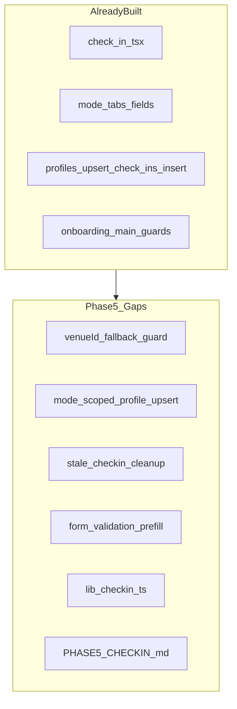
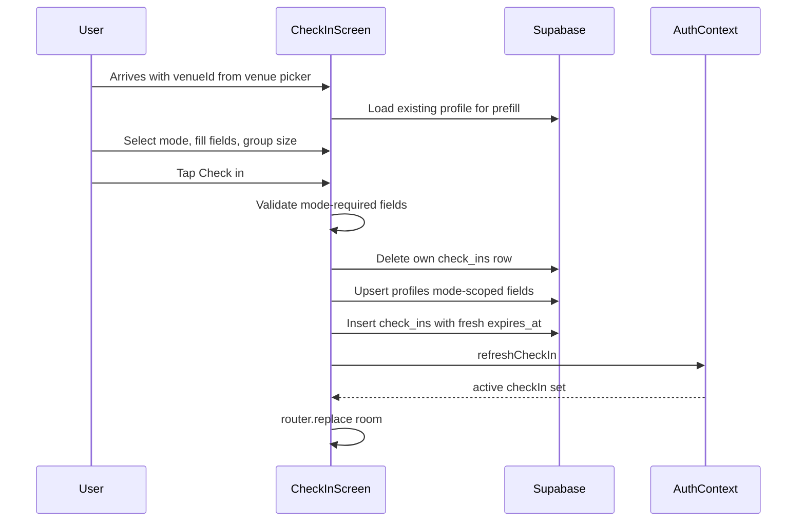

# Side Quest — Phase 5: Mode, Profile & Check-in (Detailed Plan)

## Phase 4 handoff

Per [docs/plans/side_quest_phase_4_e42e472b.plan.md](docs/plans/side_quest_phase_4_e42e472b.plan.md) and [.cursor/STATE.md](.cursor/STATE.md):

- Phase 4 repo-side complete: 1 km gate, [`lib/venues.ts`](lib/venues.ts), config guard, [`docs/PHASE4_VENUE.md`](docs/PHASE4_VENUE.md)
- Phase 2 remote `db push` still **deferred**
- **Your choice:** Phase 5 = **repo-side hardening only** (no live check-in / profile insert testing yet)

Live Phase 5 validation requires: authenticated session, remote DB with `profiles` + `check_ins` tables, venue selected from Phase 4 flow.

---

## Phase 0 intent (scope boundary)

From [docs/plans/side_quest_phase_0_50bd8a65.plan.md](docs/plans/side_quest_phase_0_50bd8a65.plan.md):

> **Goal:** Intent-segmented profile + active check-in creation.

**In scope**

- [`app/(onboarding)/check-in.tsx`](app/(onboarding)/check-in.tsx) — mode tabs, dynamic fields, group size, submit
- Mode-specific profile fields (friends / networking / dating)
- Upsert `profiles` + insert `check_ins` with `expires_at`
- One check-in per user (stale row cleanup)
- `venueId` handoff from Phase 4 ([`SELECTED_VENUE_KEY`](app/(onboarding)/venue.tsx))
- Phase 5-focused docs and repo-side validation

**Out of scope**

- Room deck, connect/block, Realtime → Phase 6 ([`app/(main)/room.tsx`](app/(main)/room.tsx) exists)
- Chat, checkout, auto-checkout → Phase 7
- Venue picker changes → Phase 4 (complete)
- New test framework → skip (no runner in repo)
- Check-in screen tooltip sequence (full 2–4 polish) → Phase 8 (optional minimal `tooltip:checkin` in Phase 5 if low effort)

---

## Current codebase audit

Check-in was implemented ahead of strict phasing (same pattern as Phases 1–4).

| Phase 5 deliverable | Status | Path |
|---------------------|--------|------|
| Check-in screen UI | Done | [`app/(onboarding)/check-in.tsx`](app/(onboarding)/check-in.tsx) |
| Mode tabs + conditional fields | Done | friends / networking / dating blocks |
| Group size selector | Done | `1:1`, `1:2`, `2:2`, `4:4` |
| Profile upsert | Partial | Upserts all fields every submit — **clears inactive mode fields** |
| Check-in insert | Done | `check_ins.insert` with `expires_at` |
| Stale row cleanup | Partial | `delete().eq('user_id')` before insert; no `expire_stale_check_ins` call |
| `venueId` param | Partial | Button disabled when missing; no redirect / AsyncStorage fallback |
| Profile prefill | **Gap** | Form starts empty; does not load existing `profiles` row |
| Mode field validation | **Gap** | No required-field checks per active mode |
| Config guard | **Gap** | No `isSupabaseConfigured` banner (auth/venue screens have it) |
| Venue context in UI | **Gap** | No venue name shown on check-in screen |
| `expires_at` timing | **Gap** | `useMemo([])` freezes expiry at mount — should compute at submit |
| Accessibility | **Gap** | No `accessibilityLabel` / `accessibilityRole` on chips, inputs, submit |
| Check-in data module | **Gap** | Submit logic inline; no [`lib/checkin.ts`](lib/checkin.ts) |
| Phase 5 docs | **Gap** | No `docs/PHASE5_CHECKIN.md` |
| Post-submit routing | Done | `refreshCheckIn()` → `router.replace('/(main)/room')` |
| Route guards | Done | [`app/(onboarding)/_layout.tsx`](app/(onboarding)/_layout.tsx), [`app/(main)/_layout.tsx`](app/(main)/_layout.tsx) |



**Conclusion:** Validate-and-reconcile (not rebuild). Fix profile overwrite bug, harden venue handoff and submit lifecycle, extract check-in lib, document deferred live validation.

---

## Target flow



---

## Implementation steps

### Step 1 — Venue handoff guard

In [`app/(onboarding)/check-in.tsx`](app/(onboarding)/check-in.tsx):

- Resolve `venueId` from `useLocalSearchParams` with fallback to [`SELECTED_VENUE_KEY`](app/(onboarding)/venue.tsx) via `AsyncStorage.getItem`
- If still missing after load: show error + `Button` to `router.replace('/(onboarding)/venue')`
- Fetch venue name via `supabase.from('venues').select('name').eq('id', venueId).maybeSingle()` for screen subtitle (e.g. "Checking in at The Ivy")
- Block submit when `!venueId` or `!isSupabaseConfigured`

### Step 2 — Extract check-in data layer

Add [`lib/checkin.ts`](lib/checkin.ts):

```typescript
export async function loadProfile(userId: string): Promise<Profile | null>
export async function clearOwnCheckIns(userId: string): Promise<void>
export function buildModeProfileUpdate(mode, fields, user): Partial<Profile>
export async function submitCheckIn(params: {
  userId: string;
  venueId: string;
  mode: IntentMode;
  groupSize: GroupSize;
  profileFields: ...;
}): Promise<CheckIn>
```

**`submitCheckIn` responsibilities:**

1. `clearOwnCheckIns(userId)` — delete existing row (handles unique constraint + expired leftovers)
2. Optional: call `expire_stale_check_ins` RPC before insert (belt-and-suspenders; not required for own row)
3. Upsert **mode-scoped** profile patch only (see Step 3)
4. Insert `check_ins` with `expires_at` computed at submit time: `now + CHECK_IN_DURATION_HOURS`
5. Return inserted row

Screen becomes thin: load profile on mount, call `submitCheckIn`, handle errors.

### Step 3 — Mode-scoped profile upsert (critical fix)

Current bug in [`check-in.tsx`](app/(onboarding)/check-in.tsx) lines 66–78: submitting in `friends` mode sets `networking_role: null` and `dating_aesthetic: null`, wiping prior mode data.

**Fix:** `buildModeProfileUpdate` returns only fields for the active mode plus shared `display_name`:

| Mode | Fields updated |
|------|----------------|
| friends | `friends_interests`, `friends_music`, `friends_hobbies`, `friends_fun_facts` |
| networking | `networking_role`, `networking_industry`, `networking_skills` |
| dating | `dating_aesthetic`, `dating_chemistry_notes` |
| all | `display_name` (required) |

Use `supabase.from('profiles').upsert({ id, display_name, ...modeFields })` — inactive mode columns untouched.

### Step 4 — Form validation and prefill

**Prefill on mount:**

- Load profile via `loadProfile(user.id)`
- Set `displayName` and mode-specific fields from existing row
- Default `displayName` from profile → `user.user_metadata` → `'Guest'`

**Validation before submit (client-side, MVP depth):**

- `displayName` trimmed, min length 1
- Per mode at least one substantive field:
  - friends: any tag field or fun fact
  - networking: role or industry
  - dating: aesthetic or chemistry notes
- Show `ErrorBanner` with specific message; disable submit while invalid

**`expires_at`:** remove mount-time `useMemo`; compute inside `submitCheckIn` at insert time.

### Step 5 — UX and accessibility polish

In [`app/(onboarding)/check-in.tsx`](app/(onboarding)/check-in.tsx):

- `isSupabaseConfigured` config banner (mirror auth/venue)
- Mode chips: `accessibilityRole="button"`, `accessibilityState={{ selected }}`, labels
- Group size chips: same pattern
- Text inputs: `accessibilityLabel` matching field labels
- Submit button: `accessibilityLabel="Check in and enter the room"`
- Loading state on submit (already partial)

Optional (low effort): first-visit `useTooltipFlag('checkin')` explaining mode-specific visibility — defer full sequence to Phase 8 if scope tight.

### Step 6 — Phase 5 documentation

Create [`docs/PHASE5_CHECKIN.md`](docs/PHASE5_CHECKIN.md):

**Sections**

1. Prerequisites: Phase 2 push, Phase 3 auth, Phase 4 venue selection
2. **Expected flow:** venue → check-in form → room redirect
3. **Mode field matrix** (which DB columns map to which UI fields)
4. **One check-in constraint:** `unique(user_id)` + client delete-before-insert
5. **SQL validation when ready:**
   ```sql
   select * from public.check_ins where user_id = '<uid>';
   select display_name, friends_interests, networking_role, dating_aesthetic
   from public.profiles where id = '<uid>';
   select * from public.venue_active_check_in_counts();
   ```
6. **Validation order:** friends mode check-in → profile fields saved → count increments → redirect to room → re-open app persists check-in via AuthContext
7. Cross-link Phase 6 (`get_room_peers` needs matching venue + mode)

Update [`README.md`](README.md) with Phase 5 pointer.

### Step 7 — Repo-side validation (no live Supabase)

```bash
npm run typecheck
```

Manual code review checklist:

- [ ] `venueId` resolved from params or `SELECTED_VENUE_KEY`; missing → redirect to venue
- [ ] Profile upsert updates only active mode fields (+ display_name)
- [ ] `clearOwnCheckIns` runs before insert
- [ ] `expires_at` computed at submit, matches `CHECK_IN_DURATION_HOURS` (4)
- [ ] Validation blocks empty display name and empty mode fields
- [ ] Post-submit: `refreshCheckIn()` + `router.replace('/(main)/room')`
- [ ] Config warning when placeholder Supabase keys

**Skip:** `lib/checkin.test.ts` — no test runner.

### Step 8 — Update project state docs

| File | Update |
|------|--------|
| [.cursor/STATE.md](.cursor/STATE.md) | Phase 5 repo complete; live check-in deferred |
| [.cursor/memory/runbooks/sidequest-mvp.md](.cursor/memory/runbooks/sidequest-mvp.md) | Phase 5 check-in hardening section |
| [.cursor/memory/memories/2026-07-09-continuation.md](.cursor/memory/memories/2026-07-09-continuation.md) | Append Phase 5 ops |

---

## Phase 5 exit checklist

**Repo-side (complete without credentials)**

- [ ] `lib/checkin.ts` with mode-scoped submit + stale cleanup
- [ ] `venueId` handoff guarded with AsyncStorage fallback
- [ ] Profile prefill + mode validation on check-in screen
- [ ] Mode-scoped upsert does not wipe inactive mode fields
- [ ] `expires_at` computed at submit time
- [ ] Config guard + a11y on check-in form
- [ ] [`docs/PHASE5_CHECKIN.md`](docs/PHASE5_CHECKIN.md) created; README linked
- [ ] `npm run typecheck` passes

**Live validation (deferred — run when ready)**

- [ ] Phase 2 remote push + seed + Phase 3 auth + Phase 4 venue select
- [ ] Friends mode check-in → `check_ins` row with correct `venue_id`, `mode`, `group_size`, future `expires_at`
- [ ] Profile fields persist per mode in `profiles` table
- [ ] `venue_active_check_in_counts` shows count for venue after check-in
- [ ] App reload → AuthContext restores check-in → lands on room (not venue)
- [ ] Second check-in (different mode) replaces row; inactive mode profile data preserved
- [ ] Expired `expires_at` row → AuthContext treats as no check-in (redirect to venue)

---

## Handoff to Phase 6

Phase 6 (discovery deck) depends on:

- Active non-expired `check_ins` row (Phase 5)
- `get_room_peers` RPC on remote DB (Phase 2)
- Same `venue_id` + `mode` as another test user

[`app/(main)/room.tsx`](app/(main)/room.tsx) already calls `fetchRoomPeers`, `requestConnection`, `blockUser`. Phase 6 work is deck UX validation, connect/block flows, and Realtime refresh — not check-in form changes.

---

## Risks and mitigations

| Risk | Mitigation |
|------|------------|
| Profile overwrite across modes | Mode-scoped upsert in `buildModeProfileUpdate` |
| `unique(user_id)` insert failure | Delete own rows before insert |
| Missing `venueId` deep link | AsyncStorage fallback + redirect to venue |
| Expired row blocks unique constraint | Delete all own rows regardless of expiry before insert |
| `expires_at` stale on long form fill | Compute at submit, not mount |
| RLS insert fails without remote DB | `isSupabaseConfigured` guard + docs |
| Phase 5 scope creep into room deck | Validate submit + redirect only; defer peers to Phase 6 |

---

## Estimated effort

- **Repo hardening (your chosen path):** ~1–1.5 hours
- **Live validation (deferred):** ~30–60 min when credentials + Phases 2–4 ready
