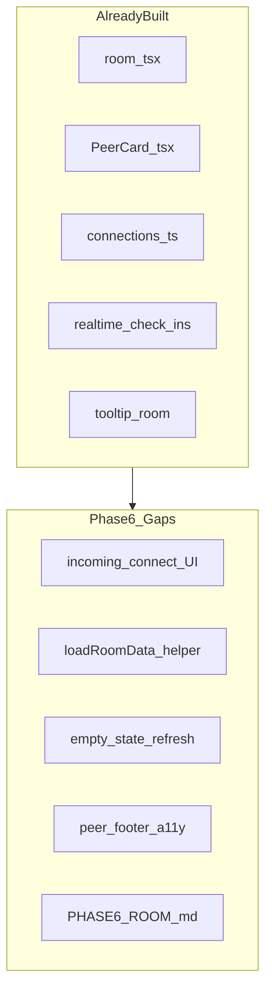
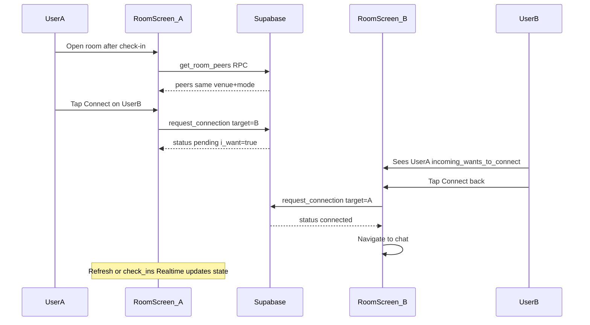

# Side Quest — Phase 6: Discovery Deck & Connections (Detailed Plan)

## Phase 5 handoff

Per [docs/plans/side_quest_phase_5_6926dc52.plan.md](docs/plans/side_quest_phase_5_6926dc52.plan.md) and [.cursor/STATE.md](.cursor/STATE.md):

- Phase 5 repo-side complete: [`lib/checkin.ts`](lib/checkin.ts), mode-scoped profile upsert, [`docs/PHASE5_CHECKIN.md`](docs/PHASE5_CHECKIN.md)
- Phase 2 remote `db push` still **deferred**
- **Your choice:** Phase 6 = **repo-side hardening only** (no live two-user connect/block testing yet)

Live Phase 6 validation requires: two authenticated users, both checked in at same venue + mode (Phases 2–5 live).

---

## Phase 0 intent (scope boundary)

From [docs/plans/side_quest_phase_0_50bd8a65.plan.md](docs/plans/side_quest_phase_0_50bd8a65.plan.md):

> **Goal:** See the room; connect and block.

**In scope**

- [`app/(main)/room.tsx`](app/(main)/room.tsx) — discovery deck UI
- [`lib/connections.ts`](lib/connections.ts) — `get_room_peers`, `request_connection`, `block_user`
- Connect → pending → mutual → "Connected" + navigate to chat
- Block instantly → peer removed from deck
- Pull-to-refresh + Realtime on `check_ins` for live room updates
- Mode-relevant profile fields on cards ([`components/PeerCard.tsx`](components/PeerCard.tsx))
- Phase 6 docs + two-user test procedure

**Out of scope**

- Chat screen hardening, message Realtime, profanity filter → Phase 7 ([`app/(main)/chat/[connectionId].tsx`](app/(main)/chat/[connectionId].tsx) exists)
- Checkout / `useAutoCheckout` deep validation → Phase 7 (already mounted in room; do not refactor lifecycle)
- Report flow polish → Phase 8 (report UI already in room; leave as-is)
- Check-in / venue changes → Phases 4–5 (complete)
- New test framework → skip

---

## Current codebase audit

Room deck was implemented ahead of strict phasing (same pattern as Phases 1–5).

| Phase 6 deliverable | Status | Path |
|---------------------|--------|------|
| Room screen UI | Done | [`app/(main)/room.tsx`](app/(main)/room.tsx) |
| `fetchRoomPeers` RPC | Done | [`lib/connections.ts`](lib/connections.ts) → `get_room_peers` |
| `requestConnection` | Done | RPC upsert + mutual `status = 'connected'` |
| `blockUser` | Done | RPC insert into `blocks`; filtered in `get_room_peers` |
| Connect → chat on mutual | Done | `handleConnect` → `router.push` to chat when `connected` |
| Mode fields on cards | Done | [`PeerCard.tsx`](components/PeerCard.tsx) `modeFields()` |
| Pull-to-refresh | Partial | Works when peers exist; **empty state has no refresh** |
| Realtime | Partial | Subscribes to `check_ins` only — **`connections` not in publication** |
| Pending UI (outgoing) | Done | `i_want && !they_want` → "Waiting for them..." |
| **Incoming connect UI** | **Gap** | No state when `they_want && !i_want` |
| **Connect button copy** | **Gap** | `Connect again` when `i_want` — misleading when pending |
| Config guard | **Gap** | No `isSupabaseConfigured` banner |
| Room data module | **Gap** | Inline fetch in screen; no `loadRoomData` helper |
| Peer card a11y | **Gap** | No `accessibilityLabel` on actions |
| Phase 6 docs | **Gap** | No `docs/PHASE6_ROOM.md` |



**Conclusion:** Validate-and-reconcile. Improve mutual-connect UX states, harden room loading, add refresh affordances, document two-user procedure, defer live testing.

---

## Target flow



---

## Implementation steps

### Step 1 — Connection state UX in PeerCard

Update [`components/PeerCard.tsx`](components/PeerCard.tsx):

| State | Condition | UI |
|-------|-----------|-----|
| Connected | `connection_status === 'connected'` | "Connected" + Chat button |
| Outgoing pending | `i_want && !they_want` | "Waiting for them to connect back"; disable Connect |
| Incoming pending | `they_want && !i_want` | "Wants to connect"; Connect label **"Connect back"** |
| Fresh | neither wants | "Connect" |

- Remove misleading `Connect again` label when outgoing pending

### Step 2 — Room data layer

Add [`lib/room.ts`](lib/room.ts):

```typescript
export async function loadRoomData(venueId: string): Promise<{
  peers: RoomPeer[];
  venue: Venue | null;
}>
```

- Parallelize `fetchRoomPeers()` + venue lookup
- Room screen: `isSupabaseConfigured` banner; skip load when unconfigured

### Step 3 — Refresh strategy (no migration)

Migration 006 adds `messages` + `check_ins` to Realtime — **not `connections`**. Phase 6 does **not** add a migration.

**Client-side mitigations:**

- `load()` after own `requestConnection` (already implemented)
- Pull-to-refresh on peer list (already implemented)
- **Empty state:** add "Refresh room" ghost button
- Document: other user may need pull-to-refresh until `connections` Realtime is post-MVP

Keep existing `check_ins` Realtime subscription for peer check-in/check-out events.

### Step 4 — Room screen UX and a11y

In [`app/(main)/room.tsx`](app/(main)/room.tsx):

- Config banner when placeholder keys
- Error state: "Try again" button calling `load()`
- Footer + PeerCard: `accessibilityLabel` on Connect, Block, Chat, Report, Check out, Sign out
- Leave `useAutoCheckout` and checkout handler unchanged (Phase 7)

### Step 5 — Phase 6 documentation

Create [`docs/PHASE6_ROOM.md`](docs/PHASE6_ROOM.md):

1. Prerequisites (Phases 2–5 live)
2. Privacy: discovery via `get_room_peers` only
3. RPC summary + connection state table
4. Two-user test: same venue + mode → visible; different mode → hidden
5. Connect / block validation steps
6. SQL inspection queries for `connections` and `blocks`
7. Phase 7 chat handoff

Update [`README.md`](README.md) two-user section with link.

### Step 6 — Repo-side validation

```bash
npm run typecheck
```

Manual checklist: RPC wiring, connection states, block reload, empty refresh, config guard, route guards.

### Step 7 — Update STATE, runbook, continuation

---

## Phase 6 exit checklist

**Repo-side (complete without credentials)**

- [ ] Connection states distinct in PeerCard (incoming / outgoing / connected)
- [ ] `lib/room.ts` + config guard on room screen
- [ ] Empty-state refresh + error retry
- [ ] Peer + footer a11y
- [ ] `docs/PHASE6_ROOM.md` + README link
- [ ] `npm run typecheck` passes

**Live validation (deferred)**

- [ ] Two users same venue + mode see each other
- [ ] Different mode/venue → no visibility
- [ ] Mutual connect → chat
- [ ] Block removes peer
- [ ] Pull-to-refresh + check_ins Realtime reload

---

## Handoff to Phase 7

Phase 7 validates [`app/(main)/chat/[connectionId].tsx`](app/(main)/chat/[connectionId].tsx), checkout button, and [`hooks/useAutoCheckout.ts`](hooks/useAutoCheckout.ts) — not room deck changes.

---

## Risks and mitigations

| Risk | Mitigation |
|------|------------|
| Stale connect state on other device | Pull-to-refresh docs; `load()` after own connect |
| `connections` not in Realtime | No Phase 6 migration; client refresh |
| Phase 6 scope creep | Room + PeerCard + docs only |

---

## Estimated effort

- **Repo hardening:** ~1–1.5 hours
- **Live validation (deferred):** ~45–90 min with two simulators
