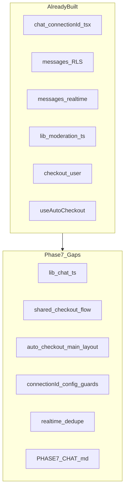
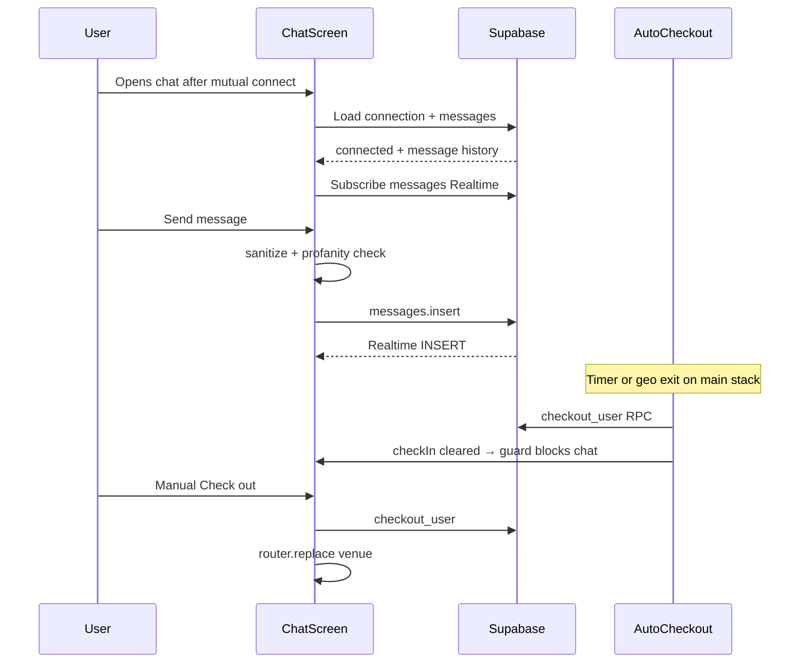

# Side Quest — Phase 7: Ephemeral Chat, Check-out & Auto Lifecycle (Detailed Plan)

## Phase 6 handoff

Per [docs/plans/side_quest_phase_6_f7a83b21.plan.md](docs/plans/side_quest_phase_6_f7a83b21.plan.md) and [.cursor/STATE.md](.cursor/STATE.md):

- Phase 6 repo-side complete: [`lib/room.ts`](lib/room.ts), PeerCard connection states, [`docs/PHASE6_ROOM.md`](docs/PHASE6_ROOM.md)
- Phase 2 remote `db push` still **deferred**
- **Your choice:** Phase 7 = **repo-side hardening only** (no live chat / checkout / auto-checkout testing yet)

Live Phase 7 validation requires: mutual connect (Phase 6 live), `messages` Realtime publication (migration 006), two users exchanging messages.

---

## Phase 0 intent (scope boundary)

From [docs/plans/side_quest_phase_0_50bd8a65.plan.md](docs/plans/side_quest_phase_0_50bd8a65.plan.md):

> **Goal:** Chat when connected; invisible again on exit.

**In scope**

- [`app/(main)/chat/[connectionId].tsx`](app/(main)/chat/[connectionId].tsx) — message list, send, Realtime
- `messages` insert + Realtime channel per connection
- Check-Out → `checkout_user` RPC → delete `check_ins` → navigate to venue
- [`hooks/useAutoCheckout.ts`](hooks/useAutoCheckout.ts) — geo exit > 1 km + `expires_at` timer
- Client guard: chat inaccessible without active check-in
- RLS-aligned access checks (connected participants only)
- Phase 7 docs + deferred live validation

**Out of scope**

- Report flow / block list polish → Phase 8
- AI moderation Edge Function → post-MVP (client filter exists in [`lib/moderation.ts`](lib/moderation.ts))
- Server-side checkout cron → post-MVP
- Room deck changes → Phase 6 (complete)
- New test framework → skip

---

## Current codebase audit

Chat and checkout were implemented ahead of strict phasing.

| Phase 7 deliverable | Status | Path |
|---------------------|--------|------|
| Chat screen UI | Done | [`app/(main)/chat/[connectionId].tsx`](app/(main)/chat/[connectionId].tsx) |
| Message load + insert | Done | `connections` + `messages` select/insert |
| Realtime messages | Done | `postgres_changes` INSERT on `messages` |
| Profanity filter | Done | [`lib/moderation.ts`](lib/moderation.ts) `containsBlockedContent`, `sanitizeMessage` |
| checkIn client guard | Done | Error + Back when `!checkIn` |
| Connection participant check | Done | Validates `user_one`/`user_two` + `status === 'connected'` |
| Chat checkout button | Partial | Calls `checkoutUser` **without** confirmation (room uses Alert) |
| Room checkout button | Done | Alert confirm → `checkoutUser` → venue |
| `checkout_user` RPC | Done | Deletes `check_ins` row |
| `useAutoCheckout` geo + expiry | Done | [`hooks/useAutoCheckout.ts`](hooks/useAutoCheckout.ts) |
| Auto-checkout mount point | **Gap** | Only on [`room.tsx`](app/(main)/room.tsx) — **not** on chat screen or main layout |
| **Chat data module** | **Gap** | Inline load/send in screen |
| **connectionId guard** | **Gap** | No redirect when param missing |
| **Config guard** | **Gap** | No `isSupabaseConfigured` banner |
| **Error retry** | **Gap** | No Try again on load failure |
| **Realtime dedupe** | **Gap** | Duplicate INSERT events could append same message twice |
| **Checkout helper** | **Gap** | Duplicated checkout logic in room + chat |
| **Chat a11y** | **Gap** | No labels on input, send, checkout |
| **Phase 7 docs** | **Gap** | No `docs/PHASE7_CHAT.md` |



**Conclusion:** Validate-and-reconcile. Extract chat module, unify checkout, ensure auto-checkout runs while user is in chat stack, harden guards and a11y, document deferred live validation.

---

## Target flow



---

## Implementation steps

### Step 1 — Chat data layer

Add [`lib/chat.ts`](lib/chat.ts):

```typescript
export async function loadChat(connectionId: string, userId: string): Promise<{
  connection: Connection;
  messages: Message[];
}>

export async function sendChatMessage(params: {
  connectionId: string;
  userId: string;
  body: string;
}): Promise<void>
```

- `loadChat`: validate connection exists, `status === 'connected'`, user is participant; then load messages ordered by `created_at`
- `sendChatMessage`: run `sanitizeMessage` + `containsBlockedContent`; throw on blocked content; insert message
- Throw typed errors for not-connected / not-participant (screen maps to `ErrorBanner`)

Refactor [`app/(main)/chat/[connectionId].tsx`](app/(main)/chat/[connectionId].tsx) to use these functions.

### Step 2 — Centralize checkout flow

Add [`lib/checkout.ts`](lib/checkout.ts) or extend [`lib/connections.ts`](lib/connections.ts):

```typescript
export async function performManualCheckout(refreshCheckIn: () => Promise<void>): Promise<void>
```

- Wraps `checkoutUser()` + `refreshCheckIn()`
- Used by room and chat screens after confirmation

Update room + chat to use shared helper; add **confirmation Alert** to chat checkout (match room UX).

### Step 3 — Auto-checkout coverage

**Problem:** [`useAutoCheckout`](hooks/useAutoCheckout.ts) is only mounted in [`room.tsx`](app/(main)/room.tsx). When user navigates to chat via stack push, room may remain mounted (hook still runs) — but this is fragile.

**Fix (recommended):** Move `useAutoCheckout` to [`app/(main)/_layout.tsx`](app/(main)/_layout.tsx):

- Load venue coords when `checkIn` present (reuse `fetchVenueName` venue lookup or small `fetchVenueById` in `lib/venues.ts`)
- Pass `venueCoords`, `expiresAt`, `enabled: !!checkIn && !!venue`
- Remove duplicate hook from `room.tsx` (single source)

**Harden hook:**

- Skip geo watch silently when permission denied (already partial)
- Document triggers: `expired`, `left_venue_area`
- Optional: no user-facing toast in Phase 7 (console.info sufficient for MVP)

### Step 4 — Chat screen UX and guards

In [`app/(main)/chat/[connectionId].tsx`](app/(main)/chat/[connectionId].tsx):

- Missing `connectionId` → error + Back to room
- `!isSupabaseConfigured` → config banner; disable send
- Load error → Try again button
- Realtime handler: dedupe by `message.id` before append
- `accessibilityLabel` on message input, Send, Check out, Back
- Keep `!checkIn` guard (redirect or Back to venue)

### Step 5 — Phase 7 documentation

Create [`docs/PHASE7_CHAT.md`](docs/PHASE7_CHAT.md):

**Sections**

1. Prerequisites: Phases 2–6 live, mutual `connected` status
2. **Chat access rules:** RLS + client guards (`checkIn`, connection participant, connected status)
3. **Message flow:** send → Realtime INSERT → both clients update
4. **Profanity filter:** client-side MVP in `lib/moderation.ts`
5. **Manual checkout:** room + chat → `checkout_user` → invisible → venue screen
6. **Auto-checkout triggers:** `expires_at` timer; geo > 1 km via `watchPositionAsync`
7. **Validation order (when ready):**
   - Mutual connect → open chat
   - Send message both directions → Realtime appears on other device
   - Manual checkout → chat blocked; peer no longer in room
   - (Optional) shorten `expires_at` in SQL for expiry test; simulator GPS far for geo test
8. **SQL validation:**
   ```sql
   select * from public.messages where connection_id = '<id>' order by created_at;
   select * from public.check_ins where user_id = '<uid>'; -- empty after checkout
   ```
9. Cross-link Phase 8 safety polish

Update [`README.md`](README.md) app flow + Phase 7 section.

### Step 6 — Repo-side validation

```bash
npm run typecheck
```

Manual checklist:

- [ ] `loadChat` validates connected + participant
- [ ] `sendChatMessage` uses moderation helpers
- [ ] Realtime dedupes by message id
- [ ] Checkout shared helper used by room + chat
- [ ] `useAutoCheckout` on main layout (or documented dual mount)
- [ ] Chat blocked when `!checkIn`
- [ ] Config warning when placeholder keys

### Step 7 — Update STATE, runbook, continuation

---

## Phase 7 exit checklist

**Repo-side (complete without credentials)**

- [ ] `lib/chat.ts` with load/send + access validation
- [ ] Shared checkout flow; chat checkout has confirmation
- [ ] `useAutoCheckout` on main stack (room + chat covered)
- [ ] Chat guards, dedupe, a11y, error retry
- [ ] `docs/PHASE7_CHAT.md` + README link
- [ ] `npm run typecheck` passes

**Live validation (deferred)**

- [ ] Connected pair sends messages; Realtime on both devices
- [ ] Profanity filter blocks send
- [ ] Manual checkout from chat → venue; no check-in row
- [ ] After checkout, chat shows unavailable guard
- [ ] Auto-checkout on expiry (test with shortened `expires_at`)
- [ ] Auto-checkout on geo exit (simulator location far from venue)

---

## Handoff to Phase 8

Phase 8 (privacy, safety & onboarding polish) depends on:

- Working report flow (already in room)
- Chat + checkout lifecycle stable (Phase 7)

Phase 8 work: tooltip sequence across screens 2–4, report polish, empty/error states audit, store privacy strings — not core chat rewrites.

---

## Risks and mitigations

| Risk | Mitigation |
|------|------------|
| Auto-checkout stops when on chat screen | Mount hook on `(main)/_layout.tsx` |
| Duplicate Realtime messages | Dedupe by `id` in INSERT handler |
| Chat accessible after checkout | `checkIn` guard + RLS requires active connection |
| RLS insert fails without remote DB | `isSupabaseConfigured` guard |
| Geo auto-checkout without permission | Hook skips watch; manual checkout still works |
| Phase 7 scope creep into reports | Leave report UI; Phase 8 polish only |

---

## Estimated effort

- **Repo hardening (your chosen path):** ~1.5 hours
- **Live validation (deferred):** ~45–90 min with two connected users
