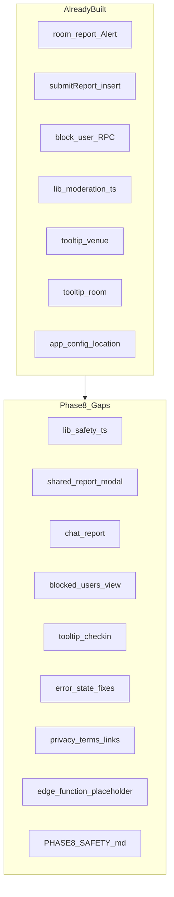
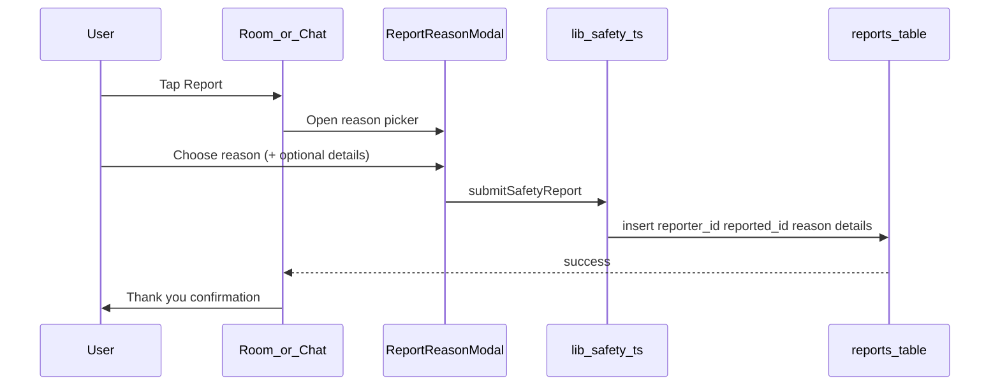
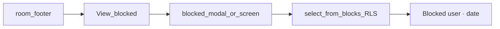

# Side Quest — Phase 8: Privacy, Safety & Onboarding Polish (Detailed Plan)

## Phase 7 handoff

Per [docs/plans/side_quest_phase_7_c8e41a92.plan.md](docs/plans/side_quest_phase_7_c8e41a92.plan.md) and [.cursor/STATE.md](.cursor/STATE.md):

- Phase 7 repo-side complete: [`lib/chat.ts`](lib/chat.ts), [`lib/checkout.ts`](lib/checkout.ts), auto-checkout on [`app/(main)/_layout.tsx`](app/(main)/_layout.tsx), [`docs/PHASE7_CHAT.md`](docs/PHASE7_CHAT.md)
- Phase 2 remote `db push` still **deferred**
- **Your choice:** Phase 8 = **repo-side hardening only** (no live report/block/tooltip testing yet)

Live Phase 8 validation requires: two users in room (Phase 6 live), optional connected chat (Phase 7 live), `reports` + `blocks` RLS (migration 002).

---

## Phase 0 intent (scope boundary)

From [docs/plans/side_quest_phase_0_50bd8a65.plan.md](docs/plans/side_quest_phase_0_50bd8a65.plan.md):

> **Goal:** Complete stated safety features at MVP depth.

**In scope**

- Report flow → `reports` table (reason + optional text)
- Block list management (minimal; unblock **not** required for MVP)
- AI moderation MVP: store report + client profanity filter; **placeholder** for future Edge Function
- Onboarding tooltip sequence across screens **2–4** (venue, check-in, room)
- Empty/error/loading state audit and targeted fixes
- App Store / Play Store privacy strings (location + legal URLs)

**Out of scope**

- Unblock RPC / UI (optional post-MVP)
- Admin moderation dashboard
- OpenAI Edge Function implementation (Phase 9 / post-MVP)
- Chat/message architecture changes (Phase 7 complete)
- New test framework
- Full offline/network stack (light hints only)
- Auth screen tooltips (screen 1 out of scope)

---

## Current codebase audit

Safety and polish were partially implemented ahead of strict phasing.

| Phase 8 deliverable | Status | Path |
|---------------------|--------|------|
| Report from room | Done | [`app/(main)/room.tsx`](app/(main)/room.tsx) `handleReport` → `submitReport` |
| Report API | Done | [`lib/connections.ts`](lib/connections.ts) `submitReport` — direct `reports` insert |
| Report reasons | Done | harassment / spam / inappropriate / other via `Alert.alert` |
| Optional `details` text | **Gap** | API accepts `details`; UI never collects it |
| Report from chat | **Gap** | [`app/(main)/chat/[connectionId].tsx`](app/(main)/chat/[connectionId].tsx) has no report |
| Block from room | Done | `blockUser` RPC + confirm + reload |
| Block list UI | **Gap** | No read path in app; RLS `blocks_select_own` exists |
| Client profanity filter | Done | [`lib/moderation.ts`](lib/moderation.ts) + [`lib/chat.ts`](lib/chat.ts) |
| Edge Function placeholder | **Gap** | No `supabase/functions/` stub or in-code comment |
| Venue tooltip (screen 2) | Done | [`app/(onboarding)/venue.tsx`](app/(onboarding)/venue.tsx) `useTooltipFlag('venue')` |
| Room tooltip (screen 4) | Done | [`app/(main)/room.tsx`](app/(main)/room.tsx) `useTooltipFlag('room')` |
| Check-in tooltip (screen 3) | **Gap** | [`app/(onboarding)/check-in.tsx`](app/(onboarding)/check-in.tsx) — deferred from Phase 5 |
| Location permission strings | Done | [`app.config.ts`](app.config.ts) iOS `infoPlist` + Android + `expo-location` plugin |
| Privacy policy / terms URLs | **Gap** | Auth footer is static text only in [`app/(auth)/index.tsx`](app/(auth)/index.tsx) |
| Store metadata docs | **Gap** | No Play Data Safety / App Privacy manifest guidance |
| Phone config banner | **Gap** | [`app/(auth)/phone.tsx`](app/(auth)/phone.tsx) unlike auth index |
| Expired session UX | **Gap** | [`hooks/useAutoCheckout.ts`](hooks/useAutoCheckout.ts) silent redirect |
| Check-in profile retry | **Gap** | Load error shown; no Try again |
| Network/offline hint | **Gap** | No shared helper; per-screen ad hoc errors |



**Conclusion:** Validate-and-reconcile. Extract safety module, unify report UX across room+chat, add minimal block list, complete tooltip trio, patch error-state gaps, wire legal URLs, document deferred AI moderation.

---

## Target flows

### Report flow (unified)



### Block list (read-only MVP)



**Note:** `profiles` RLS is own-row only — block list shows `blocked_id` + `created_at` (anonymized label) unless a future RPC adds display names. Do **not** add migration in Phase 8 unless user requests names.

---

## Implementation steps

### Step 1 — Safety data layer

Add [`lib/safety.ts`](lib/safety.ts):

```typescript
export const REPORT_REASONS = [
  { id: 'harassment', label: 'Harassment' },
  { id: 'spam', label: 'Spam' },
  { id: 'inappropriate', label: 'Inappropriate' },
  { id: 'other', label: 'Other' },
] as const;

export type BlockedUserRow = {
  blocked_id: string;
  created_at: string;
};

export async function fetchMyBlocks(): Promise<BlockedUserRow[]>
export async function submitSafetyReport(params: {
  reportedId: string;
  connectionId?: string | null;
  reason: string;
  details?: string;
}): Promise<void>
```

- Move `submitReport` implementation from [`lib/connections.ts`](lib/connections.ts) → `submitSafetyReport` (re-export from connections for backward compat or update all imports)
- `fetchMyBlocks`: `supabase.from('blocks').select('blocked_id, created_at').order('created_at', { ascending: false })`

### Step 2 — Shared report UX

Add [`components/ReportReasonModal.tsx`](components/ReportReasonModal.tsx) (or inline modal in a new hook `useReportUser`):

- Props: `visible`, `onClose`, `onSubmit(reason, details?)`, `reportedLabel?`
- Reason chips/buttons from `REPORT_REASONS`
- Optional multiline `TextInput` for details (shown for all reasons; emphasized for "Other")
- Cross-platform — **do not** use `Alert.prompt` (iOS-only; removed in Phase 6 runbook)
- `accessibilityLabel` on reason buttons and details input

Refactor [`app/(main)/room.tsx`](app/(main)/room.tsx):

- Replace inline `handleReport` / `submitReportReason` Alert chain with modal
- Pass `connectionId` from `peer.connection_id` as today

Wire [`app/(main)/chat/[connectionId].tsx`](app/(main)/chat/[connectionId].tsx):

- Add "Report" ghost/danger button in footer or header area
- Derive `reportedId` from connection: the participant who is not `user.id`
- Pass `connectionId` param to report

### Step 3 — Minimal block list

**Option A (recommended, no new route):** Modal from room footer

- Add "Blocked users" link/button on [`app/(main)/room.tsx`](app/(main)/room.tsx) footer (near checkout)
- Modal loads `fetchMyBlocks` on open
- Empty state: "No blocked users"
- Row: "Blocked user" + formatted date (no PII beyond what user already knew)
- Read-only — no unblock in MVP

**Option B (if navigation cleaner):** `app/(main)/blocked.tsx` stack screen — only if modal feels cramped

### Step 4 — Check-in tooltip (screen 3)

In [`app/(onboarding)/check-in.tsx`](app/(onboarding)/check-in.tsx):

- Import `useTooltipFlag('checkin')` + `TooltipOverlay`
- Copy (suggested):

  > **Title:** "You're visible in one mode"
  > **Message:** "Pick friends, dating, or networking. Only people in the same venue and mode can see you. Your session ends when you check out or after a few hours."

- Wrap screen content same pattern as venue.tsx / room.tsx

**Tooltip sequence doc:** Independent AsyncStorage flags (`tooltip:venue`, `tooltip:checkin`, `tooltip:room`) — each shows once on first visit. Document order in `PHASE8_SAFETY.md`; no forced sequential gate required for MVP.

### Step 5 — Error / empty state audit

Targeted fixes only — no full network layer.

| Screen | Fix |
|--------|-----|
| [`app/(auth)/phone.tsx`](app/(auth)/phone.tsx) | Add `isSupabaseConfigured` banner (match auth index) |
| [`app/(onboarding)/check-in.tsx`](app/(onboarding)/check-in.tsx) | Profile load error → "Try again" button |
| [`hooks/useAutoCheckout.ts`](hooks/useAutoCheckout.ts) | Before `router.replace` on `expired`, optional one-line `Alert.alert('Session ended', 'Your check-in expired. You're invisible again.')` — skip for `left_venue_area` or use shorter copy |
| Shared | Add [`lib/errors.ts`](lib/errors.ts) `isNetworkError(e: unknown): boolean` — detect `TypeError: Network request failed` / fetch failures; screens can map to friendly "Check your connection" suffix |

**Do not** add NetInfo dependency in Phase 8 unless already installed.

### Step 6 — Privacy & store strings

**Env + config**

Add to [`.env.example`](.env.example):

```bash
EXPO_PUBLIC_PRIVACY_POLICY_URL=https://example.com/privacy
EXPO_PUBLIC_TERMS_URL=https://example.com/terms
```

Wire in [`app.config.ts`](app.config.ts) `extra`:

```typescript
privacyPolicyUrl: process.env.EXPO_PUBLIC_PRIVACY_POLICY_URL,
termsUrl: process.env.EXPO_PUBLIC_TERMS_URL,
```

Add [`constants/legal.ts`](constants/legal.ts) or read from `expo-constants` extra with placeholder fallbacks for dev.

**Auth footer** — [`app/(auth)/index.tsx`](app/(auth)/index.tsx):

- Replace static footer with tappable "Privacy" / "Terms" links (`Linking.openURL`)
- Graceful disable when URLs unset (dev placeholder keys)

**Store strings audit** (document, don't require live store accounts):

- iOS: location strings already in `infoPlist` — document App Privacy questionnaire answers in `PHASE8_SAFETY.md` (location, user ID, not used for tracking)
- Android: `ACCESS_FINE_LOCATION` + adaptive icon — document Play Data Safety form mapping
- No `NSUserTrackingUsageDescription` needed (no ads/tracking in MVP)

### Step 7 — Moderation stub

- Add file header comment in [`lib/moderation.ts`](lib/moderation.ts):

  ```typescript
  // MVP: client-side substring filter only.
  // Future: supabase/functions/moderate-message — OpenAI moderation on reports/messages.
  ```

- Create [`supabase/functions/README.md`](supabase/functions/README.md):

  - Placeholder for `moderate-report` Edge Function
  - Requires `OPENAI_API_KEY` server-side only (see `.env.example` comment)
  - Not deployed in Phase 8

### Step 8 — Phase 8 documentation

Create [`docs/PHASE8_SAFETY.md`](docs/PHASE8_SAFETY.md):

**Sections**

1. Prerequisites: Phases 2–7 live
2. **Report flow:** reasons, optional details, room + chat entry points
3. **Block flow:** instant block from room; block list read-only; `get_room_peers` filtering
4. **Moderation MVP:** client filter words; reports table; deferred Edge Function
5. **Tooltip sequence:** venue → check-in → room (independent first-visit flags)
6. **Privacy strings:** env URLs, location permissions, store checklist
7. **Validation order (when ready):**
   - User A reports User B from room → row in `reports`
   - Report with details from chat
   - User A blocks User B → B disappears from A's deck; row in `blocks`
   - Block list shows entry
   - Tooltips show once per screen (clear AsyncStorage keys to retest)
8. **SQL validation:**
   ```sql
   select id, reason, details, connection_id, created_at
   from public.reports
   where reporter_id = '<uid>'
   order by created_at desc;

   select blocked_id, created_at
   from public.blocks
   where blocker_id = '<uid>';
   ```
9. Handoff to Phase 9 (env, push, E2E)

Update [`README.md`](README.md) Phase 8 section.

### Step 9 — Repo-side validation

```bash
npm run typecheck
```

Manual checklist:

- [ ] `submitSafetyReport` used by room + chat
- [ ] Report modal collects optional details
- [ ] Block list loads via RLS
- [ ] Check-in tooltip shows once
- [ ] Phone screen config banner
- [ ] Auth privacy/terms links open when URLs set
- [ ] Auto-checkout expiry shows user-facing message
- [ ] Edge Function placeholder documented

### Step 10 — Update STATE, runbook, continuation

---

## Phase 8 exit checklist

**Repo-side (complete without credentials)**

- [ ] `lib/safety.ts` with report + block list helpers
- [ ] Shared report modal; room + chat wired
- [ ] Minimal blocked-users view
- [ ] Check-in tooltip (`tooltip:checkin`)
- [ ] Error-state fixes (phone banner, check-in retry, expiry message)
- [ ] Privacy/terms env + auth links + `PHASE8_SAFETY.md`
- [ ] Moderation stub comment + `supabase/functions/README.md`
- [ ] `npm run typecheck` passes

**Live validation (deferred)**

- [ ] Report from room inserts row with reason
- [ ] Report from chat includes `connection_id`
- [ ] Optional details persisted
- [ ] Block removes peer from deck immediately
- [ ] Block list shows blocked entry
- [ ] Blocked user cannot reconnect (RPC filter)
- [ ] Tooltips: venue, check-in, room each once
- [ ] Privacy links open in browser

---

## Handoff to Phase 9

Phase 9 (environment, secrets & launch checklist) depends on:

- Safety flows stable at MVP depth (Phase 8)
- Full client path code-complete (Phases 1–8)

Phase 9 work: `.env` wiring, `supabase db push`, provider credentials, E2E checklist, type regen — not safety feature rewrites.

---

## Risks and mitigations

| Risk | Mitigation |
|------|------------|
| Block list can't show names (profiles RLS) | Anonymized list; document limitation; optional RPC deferred |
| `Alert.prompt` for details (iOS-only) | Use shared modal with TextInput |
| Report spam / duplicate submits | MVP: allow multiple reports; no rate limit in Phase 8 |
| Privacy URLs unset in dev | Links disabled or open placeholder; document in Phase 9 |
| Phase 8 scope creep into AI moderation | Stub comment + README only; no Edge Function deploy |
| Unblock requested mid-phase | Explicitly out of scope; note in docs |
| Chat report wrong participant | Derive reportedId from connection participant check |

---

## Estimated effort

- **Repo hardening (chosen path):** ~2–2.5 hours
- **Live validation (deferred):** ~45–60 min with two users in room + optional chat

---

## File map (expected touches)

| Piece | Path |
|-------|------|
| Safety module | `lib/safety.ts` (new) |
| Report modal | `components/ReportReasonModal.tsx` (new) |
| Error helper | `lib/errors.ts` (new, optional) |
| Legal constants | `constants/legal.ts` (new) |
| Room | `app/(main)/room.tsx` |
| Chat | `app/(main)/chat/[connectionId].tsx` |
| Check-in | `app/(onboarding)/check-in.tsx` |
| Phone auth | `app/(auth)/phone.tsx` |
| Auth hero | `app/(auth)/index.tsx` |
| Auto-checkout | `hooks/useAutoCheckout.ts` |
| Moderation | `lib/moderation.ts` |
| Edge stub | `supabase/functions/README.md` (new) |
| Config | `app.config.ts`, `.env.example` |
| Docs | `docs/PHASE8_SAFETY.md`, `README.md` |
