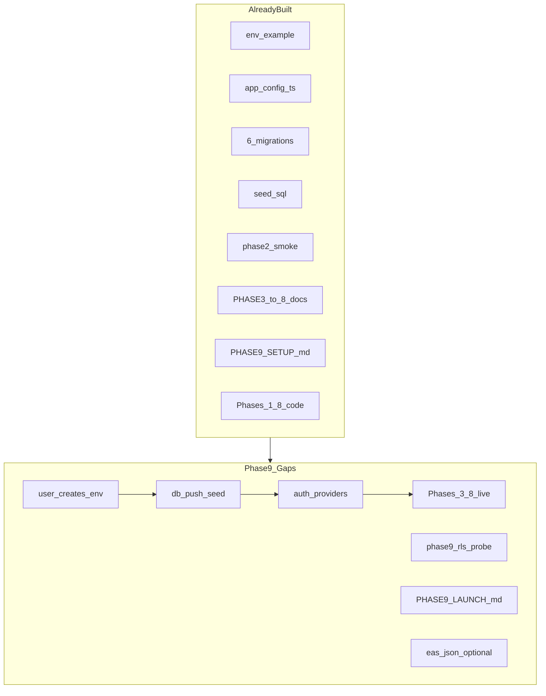
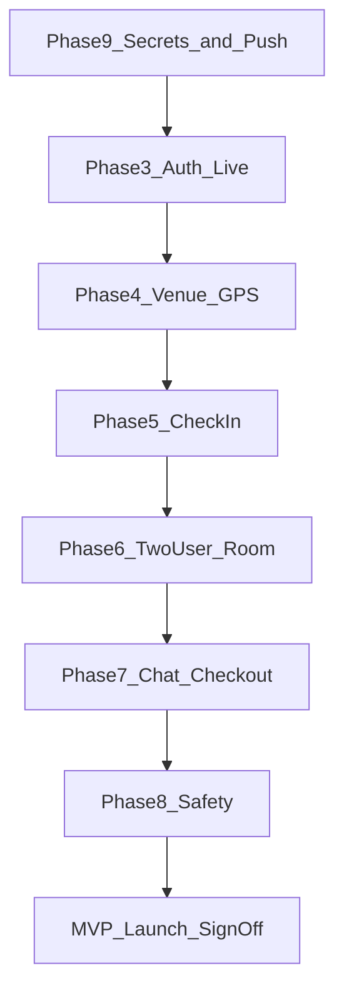

# Side Quest — Phase 9: Environment, Secrets & Launch Checklist (Detailed Plan)

## Phase 8 handoff

Per [docs/plans/side_quest_phase_8_a8f2c91e.plan.md](docs/plans/side_quest_phase_8_a8f2c91e.plan.md) and [.cursor/STATE.md](.cursor/STATE.md):

- Phases 1–8 **repo-side complete** — full client path code-complete
- Phase 2 remote `db push` still **deferred** (no linked Supabase project)
- No `.env` in repo (gitignored); placeholder keys allow Metro boot only
- All Phases 3–8 **live validation deferred** until credentials + push

Phase 9 is the **first phase that requires live credentials** to finish. Unlike Phases 1–8, "repo-side only" is not a valid completion mode for the full MVP — but repo-side **prep artifacts** (validation doc, RLS probe, EAS skeleton) can ship before secrets arrive.

---

## Phase 0 intent (scope boundary)

From [docs/plans/side_quest_phase_0_50bd8a65.plan.md](docs/plans/side_quest_phase_0_50bd8a65.plan.md):

> **Goal:** User provides secrets once; agent completes wiring and remaining tasks.

**In scope**

- `.env` from [`.env.example`](.env.example) — Supabase URL/anon key, OAuth, legal URLs
- `supabase link` + `db push` + seed (6 migrations)
- Post-push smoke: [`supabase/tests/phase2_smoke.sql`](supabase/tests/phase2_smoke.sql)
- Auth provider dashboard config (phone, Google, Apple)
- Live validation Phases 3–8 per phase docs (unified order below)
- MVP launch checklist (core, security, quality)
- Optional: `npm run db:types`, `eas.json` skeleton
- Final docs: [`docs/PHASE9_LAUNCH.md`](docs/PHASE9_LAUNCH.md) orchestration guide

**Out of scope (post-MVP — Phase 0 § deferred)**

- App Store / Play Store **submission** and marketing assets
- Production AI moderation Edge Function deploy
- Push notifications, venue partnerships, premium tiers
- E2E automation framework (Maestro/Detox) — manual checklist only for MVP
- Custom venue seed for non-Sydney cities (document procedure; user provides coords if needed)
- `service_role` in client, admin moderation dashboard

---

## Current codebase audit

Launch infrastructure is largely documented; execution is blocked on credentials.

| Phase 9 deliverable | Status | Path |
|---------------------|--------|------|
| Env template | Done | [`.env.example`](.env.example) — Supabase, OAuth, legal URLs |
| Env gitignore | Done | [`.gitignore`](.gitignore) — `.env` ignored |
| Expo config wiring | Done | [`app.config.ts`](app.config.ts) → `extra` + location strings |
| Supabase client | Done | [`lib/supabase.ts`](lib/supabase.ts) — `isSupabaseConfigured` guard |
| Auth + callback | Done | [`lib/auth.ts`](lib/auth.ts), [`app/auth/callback.tsx`](app/auth/callback.tsx), [`hooks/useAuthDeepLink.ts`](hooks/useAuthDeepLink.ts) |
| Migrations (6) | Done | [`supabase/migrations/`](supabase/migrations/) |
| Seed (Sydney CBD) | Done | [`supabase/seed.sql`](supabase/seed.sql) |
| Phase 2 smoke SQL | Done | [`supabase/tests/phase2_smoke.sql`](supabase/tests/phase2_smoke.sql) |
| `db:types` script | Done | [`package.json`](package.json) `npm run db:types` |
| Launch checklist doc | Partial | [`docs/PHASE9_SETUP.md`](docs/PHASE9_SETUP.md) — exists, all boxes unchecked |
| Unified E2E orchestration | **Gap** | No `PHASE9_LAUNCH.md`; validation scattered across PHASE3–8 |
| Remote link / push | **Gap** | Not linked; `supabase/.temp` gitignored |
| `.env` (local) | **Gap** | User must create |
| `types/database.generated.ts` | **Gap** | Requires link + `db:types` |
| RLS penetration SQL | **Gap** | Only noted in smoke README |
| `eas.json` | **Gap** | Not created |
| EAS in TOOLS.md | **Gap** | Expo CLI listed; EAS not |
| Live Phases 3–8 validation | **Gap** | All deferred |
| Legal URLs (real) | **Gap** | `example.com` placeholders in `.env.example` |



**Conclusion:** Phase 9 = **credential gate → remote apply → auth enable → waterfall live validation → launch sign-off**. Repo can prep orchestration docs and RLS probe SQL before secrets.

---

## Secrets contract (user vs agent)

### User must provide / complete manually

| Item | Action |
|------|--------|
| Supabase project | Create at dashboard; copy URL + anon key |
| `.env` | `cp .env.example .env` and fill keys |
| Supabase Auth | Enable Phone, Google, Apple; add redirect URLs |
| Google Cloud | OAuth Web client (+ iOS/Android for store builds) |
| Apple Developer | Sign in with Apple for `com.sidequest.app` |
| Legal URLs | Real privacy policy + terms before store (can use placeholders for dev E2E) |
| Test devices | Two simulators or device + simulator for two-user flow |
| GPS | Simulator location near Sydney seed venues (see [docs/PHASE4_VENUE.md](docs/PHASE4_VENUE.md)) |

### Agent executes after secrets in `.env`

| Step | Command / action |
|------|------------------|
| Verify config | `npx expo config --type public` — real Supabase URL in extra |
| Link project | `supabase login` → `supabase link --project-ref <ref> --yes` |
| Push schema | `supabase db push --linked --yes` |
| Seed venues | `supabase db execute -f supabase/seed.sql --linked` |
| Verify migrations | `supabase migration list --linked` — Local = Remote × 6 |
| Smoke test | Run `phase2_smoke.sql` in SQL Editor |
| Regen types | `npm run db:types` — compare to `types/database.ts` |
| Start app | `npm start` — config banners should disappear |
| Live validation | Phases 3–8 order (below) |
| Security | RLS probe + bundle scan for `service_role` |

---

## Target validation waterfall



**Order rationale:** Each phase depends on the prior live path. Do not skip ahead — e.g. room test requires two checked-in users; chat requires mutual connect.

### Consolidated live validation (from phase docs)

| Phase | Doc | Key checks |
|-------|-----|------------|
| **2** (push) | [supabase/tests/README.md](supabase/tests/README.md) | Smoke SQL all `true`; 5 venues |
| **3** | [docs/PHASE3_AUTH.md](docs/PHASE3_AUTH.md) | Phone OTP first; then Google; Apple iOS; session persist; sign-out → hero |
| **4** | [docs/PHASE4_VENUE.md](docs/PHASE4_VENUE.md) | Near venue selectable; far disabled; tooltip once; navigate check-in |
| **5** | [docs/PHASE5_CHECKIN.md](docs/PHASE5_CHECKIN.md) | Insert check-in; mode fields; redirect room; SQL verify row |
| **6** | [docs/PHASE6_ROOM.md](docs/PHASE6_ROOM.md) | Two users same venue+mode; connect both ways; block; refresh for connect state |
| **7** | [docs/PHASE7_CHAT.md](docs/PHASE7_CHAT.md) | Messages Realtime; profanity block; manual + auto checkout |
| **8** | [docs/PHASE8_SAFETY.md](docs/PHASE8_SAFETY.md) | Report room+chat; block list; tooltips; privacy links |

**Two-user test:** Minimum for Phases 6–8. Use two simulators or one device + one simulator. Same GPS near a seed venue (e.g. The Ivy, Sydney).

**Connections Realtime gap:** `connections` not in publication — User B may need pull-to-refresh on room after User A connects ([docs/PHASE6_ROOM.md](docs/PHASE6_ROOM.md)).

---

## Implementation steps

### Step 1 — Secrets contract & env verification (repo-side + gated)

**Repo-side (no credentials):**

- Create [`docs/PHASE9_LAUNCH.md`](docs/PHASE9_LAUNCH.md) — master orchestration (this plan's validation waterfall + checklists)
- Expand [`docs/PHASE9_SETUP.md`](docs/PHASE9_SETUP.md) — cross-link PHASE9_LAUNCH, legal URLs, two-user prerequisites
- Add env verification note to README:

```bash
npx expo config --type public | grep -E 'supabaseUrl|scheme'
# Expect real *.supabase.co URL, not placeholder
```

**Gated (requires `.env`):**

- Confirm `isSupabaseConfigured === true` in app (config banners hidden)
- [`lib/healthcheck.ts`](lib/healthcheck.ts) logs session probe on startup — check Metro console

### Step 2 — Remote database apply (gated)

Follow [`.cursor/skills/supabase-linked-migrations/SKILL.md`](.cursor/skills/supabase-linked-migrations/SKILL.md):

```bash
supabase login
supabase link --project-ref <ref> --yes
supabase db push --linked --yes
supabase db execute -f supabase/seed.sql --linked
supabase migration list --linked
```

**Verify:**

- 6 migrations Local = Remote
- SQL Editor: [`supabase/tests/phase2_smoke.sql`](supabase/tests/phase2_smoke.sql) — all checks pass
- Dashboard → Realtime → `messages`, `check_ins` in publication

**Optional type regen:**

```bash
npm run db:types
# Diff types/database.generated.ts vs types/database.ts — reconcile if drift
```

### Step 3 — Auth providers (gated, mostly manual)

Per [docs/PHASE3_AUTH.md](docs/PHASE3_AUTH.md) and [docs/PHASE9_SETUP.md](docs/PHASE9_SETUP.md):

1. **Redirect URLs** in Supabase Dashboard:
   - `sidequest://auth/callback`
   - Expo dev URI (log via `makeRedirectUri` — see PHASE3_AUTH)
2. **Phone** — enable provider; Twilio or test numbers for dev (**recommended first live test**)
3. **Google** — Web client ID in Supabase + `EXPO_PUBLIC_GOOGLE_WEB_CLIENT_ID` in `.env`
4. **Apple** — Services ID + key; iOS device test

**Note:** `EXPO_PUBLIC_GOOGLE_WEB_CLIENT_ID` is in `app.config.ts` extra but OAuth flows through Supabase `signInWithOAuth` — the env var documents the Web client for dashboard parity; native Google SDK is not used in MVP.

**Live Phase 3 checklist** — all items in PHASE3_AUTH § "Live validation checklist".

### Step 4 — Phases 4–5 live (single user, gated)

**Phase 4** — [docs/PHASE4_VENUE.md](docs/PHASE4_VENUE.md):

- Set simulator GPS near Sydney seed venue (coordinates in doc)
- Venue list loads; 1 km gate works; counts show aggregates
- First-visit venue tooltip

**Phase 5** — [docs/PHASE5_CHECKIN.md](docs/PHASE5_CHECKIN.md):

- Complete check-in form; land on room
- SQL: `select * from check_ins where user_id = '<uid>'`

### Step 5 — Phases 6–8 live (two users, gated)

**Phase 6** — [docs/PHASE6_ROOM.md](docs/PHASE6_ROOM.md):

- User A + B: same venue, same mode, different accounts
- See each other in deck; mutual connect → chat navigation
- Block removes peer; pull-to-refresh for connect state

**Phase 7** — [docs/PHASE7_CHAT.md](docs/PHASE7_CHAT.md):

- Bidirectional messages via Realtime
- Profanity filter rejects send
- Manual checkout from chat; auto-checkout tests optional (SQL expiry / far GPS)

**Phase 8** — [docs/PHASE8_SAFETY.md](docs/PHASE8_SAFETY.md):

- Report with details from room and chat
- Block list modal entry
- Check-in tooltip (clear AsyncStorage `tooltip:checkin` to retest)
- Privacy/Terms links if URLs set

### Step 6 — Security audit (repo-side SQL + gated app)

**Add** [`supabase/tests/phase9_rls_probe.sql`](supabase/tests/phase9_rls_probe.sql):

```sql
-- Run as authenticated user A in SQL editor (set role) OR verify via app:
-- 1. Direct select all profiles should return only own row (or zero without auth)
-- 2. Direct select all check_ins should fail RLS for other users
-- 3. get_room_peers returns only same venue+mode peers
-- Document expected outcomes in supabase/tests/README.md
```

**Bundle scan (agent):**

```bash
grep -r "service_role" --include="*.ts" --include="*.tsx" . || true
# Expect no matches in app/lib
```

**Confirm:** `.env` gitignored; only `.env.example` committed.

### Step 7 — Optional EAS prep (repo-side)

**Add** [`eas.json`](eas.json) skeleton:

```json
{
  "cli": { "version": ">= 13.0.0" },
  "build": {
    "development": { "developmentClient": true, "distribution": "internal" },
    "preview": { "distribution": "internal" },
    "production": {}
  },
  "submit": { "production": {} }
}
```

**Update** [`.cursor/TOOLS.md`](.cursor/TOOLS.md) — EAS CLI, `eas build`, `eas submit` entries.

**Document in PHASE9_LAUNCH:** `eas init` when ready for TestFlight / Play Internal Testing — not required for dev-client E2E.

### Step 8 — MVP launch checklist sign-off

From [docs/PHASE9_SETUP.md](docs/PHASE9_SETUP.md) §6 — mark complete when validated:

**Core**

- [ ] E2E: signup → venue → check-in → discover → connect → chat → checkout
- [ ] Auto checkout: expiry + geo exit (optional geo test)
- [ ] Block removes peer immediately
- [ ] Venue counts = aggregates only

**Security**

- [ ] RLS probe documented
- [ ] No service role in client
- [ ] `.env` not committed

**Quality**

- [ ] iOS + Android smoke on physical device (or simulator for MVP dev sign-off)
- [ ] Error states: no GPS, network, expired session (Phase 8 fixes)
- [ ] A11y labels on primary actions (Phases 4–8)

**Documentation**

- [ ] [`.cursor/memory/MEMORY.md`](.cursor/memory/MEMORY.md) — remote DB linked, launch status
- [ ] [`.cursor/memory/runbooks/sidequest-mvp.md`](.cursor/memory/runbooks/sidequest-mvp.md) — Phase 9 exit recorded
- [ ] [`README.md`](README.md) — launch section updated

### Step 9 — Update STATE, runbook, continuation

Record: project ref (non-secret label), push date, validation status per phase, open post-MVP items.

---

## Phase 9 exit checklist

**Repo-side prep (can complete without credentials)**

- [ ] `docs/PHASE9_LAUNCH.md` created (orchestration guide)
- [ ] `docs/PHASE9_SETUP.md` expanded + cross-linked
- [ ] `supabase/tests/phase9_rls_probe.sql` added
- [ ] `supabase/tests/README.md` updated
- [ ] Optional `eas.json` skeleton
- [ ] `.cursor/TOOLS.md` EAS entries
- [ ] README launch section updated

**Credential-gated (required for MVP complete)**

- [ ] `.env` populated with real Supabase URL + anon key
- [ ] `supabase link` + `db push` + seed — 6 migrations applied
- [ ] `phase2_smoke.sql` all checks pass
- [ ] Auth: phone OTP live (minimum); Google/Apple per platform target
- [ ] Phase 4–5 single-user live validation
- [ ] Phase 6–8 two-user live validation
- [ ] RLS probe results documented
- [ ] MVP launch checklist §6 signed off

**Explicitly deferred (post-MVP)**

- [ ] App Store / Play Store submission
- [ ] Production Edge Function
- [ ] Push notifications
- [ ] Custom non-Sydney venue seed (unless user requests during Phase 9)

---

## Handoff post-MVP

After Phase 9 sign-off, the greenfield MVP plan ([docs/plans/side_quest_phase_0_50bd8a65.plan.md](docs/plans/side_quest_phase_0_50bd8a65.plan.md)) is **complete**. Further work is product iteration, not phase execution:

- Store submission assets and review
- `moderate-report` Edge Function
- Connections Realtime publication
- Unblock UI, admin moderation
- E2E test automation

---

## Risks and mitigations

| Risk | Mitigation |
|------|------------|
| User lacks Supabase project | Phase 9 blocks; document exact dashboard steps; agent cannot proceed without ref + keys |
| OAuth redirect mismatch | Log `makeRedirectUri`; add all variants to Supabase Dashboard (PHASE3_AUTH) |
| Sydney seed venues far from tester GPS | PHASE4 doc simulator override; optional custom seed SQL if user provides coords |
| Two-user test friction | Document two-simulator setup; phone auth fastest for second account |
| Mutual connect delay without connections Realtime | Document pull-to-refresh on room (PHASE6) |
| `db push` fails on existing remote schema | Use `supabase migration list`; repair only per skill cautions |
| Legal URL placeholders block store | Real URLs before submission; dev E2E can proceed without |
| Phase 9 scope creep into new features | Strictly validation + ops; feature requests → post-MVP backlog |

---

## Estimated effort

| Track | Time |
|-------|------|
| Repo-side prep (docs, RLS probe, EAS skeleton) | ~1–1.5 hours |
| User manual setup (Supabase + OAuth dashboards) | ~1–2 hours (user) |
| Agent: push + smoke + db:types | ~30 min |
| Live validation Phases 3–8 | ~2–4 hours (two-user, all platforms) |
| MVP launch sign-off + memory updates | ~30 min |

**Total to MVP-complete:** ~5–8 hours elapsed (much user-gated).

---

## File map (expected touches)

| Piece | Path |
|-------|------|
| Launch orchestration | `docs/PHASE9_LAUNCH.md` (new) |
| Setup checklist | `docs/PHASE9_SETUP.md` (expand) |
| RLS probe | `supabase/tests/phase9_rls_probe.sql` (new) |
| Test README | `supabase/tests/README.md` |
| EAS skeleton | `eas.json` (optional new) |
| Tools registry | `.cursor/TOOLS.md` |
| README | `README.md` |
| State / runbook / memory | `.cursor/STATE.md`, runbook, continuation |
| Env (user local) | `.env` (not committed) |
| Generated types | `types/database.generated.ts` (after link) |

## Related docs

| Phase | Validation doc |
|-------|----------------|
| 3 Auth | [docs/PHASE3_AUTH.md](docs/PHASE3_AUTH.md) |
| 4 Venue | [docs/PHASE4_VENUE.md](docs/PHASE4_VENUE.md) |
| 5 Check-in | [docs/PHASE5_CHECKIN.md](docs/PHASE5_CHECKIN.md) |
| 6 Room | [docs/PHASE6_ROOM.md](docs/PHASE6_ROOM.md) |
| 7 Chat | [docs/PHASE7_CHAT.md](docs/PHASE7_CHAT.md) |
| 8 Safety | [docs/PHASE8_SAFETY.md](docs/PHASE8_SAFETY.md) |
| DB push skill | [.cursor/skills/supabase-linked-migrations/SKILL.md](.cursor/skills/supabase-linked-migrations/SKILL.md) |
| Runbook | [.cursor/memory/runbooks/sidequest-mvp.md](.cursor/memory/runbooks/sidequest-mvp.md) |
